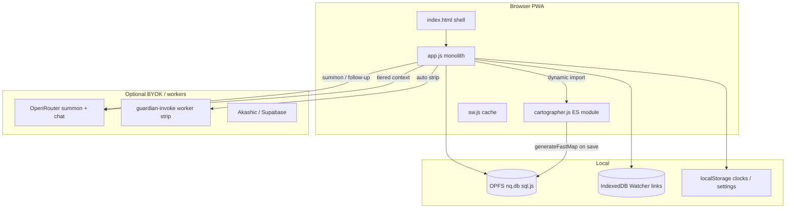

# NakedQuantum — Code Review Checkpoint (May 2026)

> **Purpose:** Single base document after the Cartographer v0.5 + Guardian G1–G5 push. Use it before the next batch to decide **what to do**, **what not to do**, and **how to work**.
>
> **Read with:** `consciousness-exoskeleton-roadmap-blueprint.md`, `guardian-refinement-roadmap-blueprint.md`, `AGENTS.md`, `lighthouse-cockpit-blueprint.md`.

---

## 0. How to use this checkpoint

| When | Action |
|------|--------|
| Starting a new session | Read §2 (snapshot), §5 (risks), §7 (next work). |
| Before “production” ship | §5.1 **P0** list — especially `NQ_DEV_MODE`. |
| Before editing Guardian/Cartographer | §3 architecture + §6 logic gaps. |
| Agent handoff | Tick decisions in §7; update **Revision log** at bottom. |

**Rules (unchanged):** zero-deps default, blueprint-first, one batch at a time, Sanctuary stays blind to Guardian.

---

## 1. Review scope & method

**Baseline:** `origin/main` after merge **PR #33** (`G1 + G4 + G5` on top of `G2 + G3 + X1`, Cartographer `CARTO_VERSION = 5`).

**Checks run:**

| Check | Result |
|-------|--------|
| `node --check` on `app.js`, `cartographer.js`, `sw.js`, `workers/guardian-invoke/worker.mjs` | Pass |
| `jshint` (es11, browser) | Warnings only — mostly loop closures and ternary line breaks; no blocking errors |
| Blueprint vs code | Mostly aligned; minor doc drift (§6) |
| Manual trace: Guardian 3-path, summon tiers, strip worker, DB migrations | Coherent |

**Out of scope for this pass:** iPhone soak tests, full XSS audit of every `innerHTML` site, encrypted-table column parity, Cloudflare worker deploy state in production.

---

## 2. Snapshot — what we have today

### 2.1 Code mass

| File | Lines (approx.) | Role |
|------|-----------------|------|
| `app.js` | ~9,800 | DB worker, Soup/Sanctuary/Abyss, Watcher, Guardian, sync, UI |
| `cartographer.js` | ~1,210 | Fast map pipeline + `checkGuardianTrigger` |
| `app.css` | ~2,600 | Visual system |
| `index.html` | ~670 | Shell markup |
| `sw.js` | ~70 | PWA cache `nq-v15`, network-first `app.js` / `app.css` |

### 2.2 Version pins

| Pin | Value | Bump when |
|-----|-------|-----------|
| `CARTO_VERSION` | **5** | Lexicon/schema breaking change in `cartographer.js` |
| Service worker | `nq-v15` | Meaningful shell/asset change |
| Guardian worker | `workers/guardian-invoke/worker.mjs` | Strip prompt/contract change — **redeploy separately** |

### 2.3 Shipped roadmap (high level)

| Area | Status |
|------|--------|
| Cartographer C1–C8 | Shipped (v0.4 → v0.5) |
| Guardian G0–G5, X1 (divergence in Tier 2) | Shipped on main |
| Guardian G6 (desktop cockpit) | Deferred → `lighthouse-cockpit-blueprint.md` |
| Auto-invoke A1–A3, onboarding A2 | **Not shipped** (intentionally waiting) |
| Abyss v0.21 (AB1, M1–M5, sheet Enter UX) | **Shipped** — see `abyss-v021-blueprint.md` |
| `app.js` module split (ARCH) | Deferred |

---

## 3. Architecture map (current truth)



### 3.1 Guardian — three doors (post G1–G5)

| Path | Trigger | Model | Memory written |
|------|---------|-------|----------------|
| **A — Strip** | `checkGuardianTrigger` after fast map | Cloudflare worker (server key) | `guardian_logs` + `theory_one_line`, `geometry_snapshot` |
| **B — Summon** | User in Guardian realm | BYOK OpenRouter + `GUARDIAN_SYSTEM_PROMPT` | Full log + thread JSON + ledger fields |
| **C — Follow-up** | User message in session | Same BYOK | Updates in-memory `guardianThread`; log on end of stream |

**Summon context diet (G3):** Tier 1 = last 3 discourses (full fast maps) → Tier 2 = top 5 watcher links with `divergenceNote` → Tier 3 = urgent deep maps only → Tier 4 = rollup; ~10k char archive cap.

**Prior witness (G1 + G2):** `buildGuardianPriorWitnessBlock` — geometry delta + **3-line WITNESS LEDGER** + short last excerpt (~2k cap).

**Strip continuity (G4):** `priorTheoryLine` from latest non-silent log → worker prompt (requires worker redeploy).

### 3.2 Cartographer → Guardian signal

- Fast map on discourse save (`generateFastMap`) when word count ≥ 30 and version stale.
- Qualifiers from `collectFastMapQualifiers` gated at `MIN_QUALIFIER_CONFIDENCE` (**0.4**).
- Auto-invoke pending flag: `nq_guardian_invoke_pending` + `guardianLastInvokeQualifiers` for summon theory line.

### 3.3 Boundaries (keep sacred)

- Guardian context is built from **Soup discourses only** — not Sanctuary chat, not Forge private sheets unless explicitly added later (don’t).
- Geometry (Cartographer + Watcher) is always-on **signal**; language (Guardian) is **rare** and dismissible.

---

## 4. What is solid (keep doing this)

1. **Separation of signal vs voice** — Cartographer/Watcher measure; Guardian speaks with caps. Architecture matches philosophy.
2. **`carto_version` remaps** — Honest refresh when lexicon changes; avoids silent stale maps.
3. **Tiered summon + budgets** — Fixes “memory bomb”; Tier 1 protected in `applyGuardianArchiveBudget`.
4. **Witness ledger** — Rule-based `theory_one_line` is inspectable and cheap; fallbacks for old logs without the column.
5. **Strip worker contract** — Small JSON payload, CORS-aware worker, no archive leak to server key path.
6. **Service worker strategy** — Network-first for `app.js` / `app.css` reduces “stale bundle” pain; `cartographer.js` not over-cached in SW precache list (updates propagate).
7. **Collaboration discipline** — Pinned blueprints + shipped log work; continue one-batch gates.

---

## 5. Issues & risks (prioritized)

### 5.1 P0 — Before any “production” release

| ID | Issue | Where | Mitigation |
|----|-------|-------|------------|
| **P0-1** | `NQ_DEV_MODE = true` hardcoded | `app.js` ~846 | Set `false` for production: restores WebAuthn boot, watcher thresholds (0.73), 48h silent period, 20h pass cooldown, **disables fake Guardian strip** in `checkAndShowGuardianInvoke` |
| **P0-2** | Guardian auto-invoke still **dev cadence** | `cartographer.js` `GUARDIAN_DEFAULT_COOLDOWN_MS = 6 * 60 * 1000` | Flip per blueprint §3 (~72h) when A1 ships |
| **P0-3** | Worker G4 prompt | Deployed worker may lag repo | Redeploy `guardian-invoke` after PR #33; verify `priorTheoryLine` in live prompt |
| **P0-4** | No user-facing auto-invoke off switch | A2 not built | Until A2: treat strip as dev-only or accept interruption risk |

### 5.2 P1 — Correctness / UX bugs (small fixes when touched)

| ID | Issue | Notes |
|----|-------|-------|
| **P1-1** | `renderGuardianLogs`: `section` and `list` both `getElementById('guardian-logs-list')` | Harmless duplicate vars; confusing for future edits |
| **P1-2** | Old logs lack `theory_one_line` | Handled via `firstSubstantiveSentence` fallback — OK |
| **P1-3** | `geometryDelta` compares snapshot `arc_direction` to live `emotional_arc.direction` | Works if both use same Cartographer string; if arc label format changes, diff may false-positive — tie to `CARTO_VERSION` |
| **P1-4** | `checkGuardianTrigger`: `shouldInvoke = qualifiers.length > 0` | No A3 “2+ high-confidence OR one strong” yet — expect noisy strip in dev |
| **P1-5** | Blueprint §8 X1 checkboxes still `[ ]` | Code ships Tier 2 `divergenceNote` — **update blueprint** to avoid agent confusion |

### 5.3 P2 — Tech debt / architecture (acceptable until laptop gate)

| ID | Topic | Stance |
|----|-------|--------|
| **P2-1** | Monolithic `app.js` | Accept for iPhone PWA; split only with Tauri/build story (ARCH) |
| **P2-2** | sql.js + Transformers from CDN | Offline-first fragile without install cache; document for users |
| **P2-3** | Many `innerHTML` + `escHtml` islands | Audit when touching UI; IE cards / sigil SVG need care |
| **P2-4** | `guardian_logs.thread` stores full session JSON | Privacy/size — consider ledger-only reload (G5 partial; optional trim later) |
| **P2-5** | Encrypted `guardian_logs_enc` schema | New columns may not exist on enc path — verify if encryption enabled |
| **P2-6** | Abyss layout is hash ritual, not semantic | AB1 honesty copy before marketing “mind map” |

### 5.4 Security & privacy (awareness)

- **WebAuthn + sovereign key** — Correct for local-first; dev bypass documented in `AGENTS.md`.
- **BYOK** — API keys in secure storage pattern; user controls OpenRouter.
- **Strip worker** — Sends only fast-map snapshot + one theory line — no full archive (good).
- **Sanctuary** — Must remain excluded from Guardian context (blueprint rule).

---

## 6. Logic gaps — dev vs production intent

Blueprint §3 documents intent; **code today behaves as dev** for several knobs:

| Knob | Code now | Production intent (blueprint) |
|------|----------|-------------------------------|
| `NQ_DEV_MODE` | `true` | `false` |
| Watcher similarity | 0.50 (dev) | 0.72+ |
| Guardian cooldown | 6 minutes | ~72 hours |
| Qualifier bar | Any qualifier + conf ≥ 0.4 | Higher confidence + A3 consensus |
| Auto strip surface | Soup header strip | Same (good) |
| Onboarding opt-out | Missing | A2 when ready |

**Implication:** Guardian may feel “chatty” and Watcher “over-linked” in daily dogfooding — that is expected until A1/A2, not necessarily bugs.

---

## 7. What to do next (recommended order)

Use this as the **default queue**; override only with explicit Kaja decision.

| Priority | Item | Why now | How |
|----------|------|---------|-----|
| 1 | **Exoskeleton E0→E2** | Closes Loops 2–3 | `consciousness-exoskeleton-roadmap-blueprint.md` — E0 ledger v2, E1 `abyss_tint`, E2 strip ledger (`main` stays dev mode) |
| 2 | **Rest / glyphs / onboarding** | Kaja chose to wait | No code required |
| 3 | **A1 — Production thresholds** | Prevents strip spam before wider use | Overlaps exoskeleton P0-a |
| 3 | **A2 — Settings + onboarding** | Ethics + sovereignty | `nq_guardian_auto_invoke_enabled`; explain strip; master toggle |
| 4 | **A3 — Qualifier consensus** | Reduces false invokes | 2+ qualifiers or one “strong” signal in `checkGuardianTrigger` |
| 5 | **Abyss v0.21** | ✅ Shipped | Maintenance only unless AB2/3D vision returns |
| 6 | **P1 cleanup** | Hygiene | `renderGuardianLogs` vars; blueprint X1 ticks |
| 7 | **G6 + ARCH** | Laptop / Tauri | `lighthouse-cockpit-blueprint.md` |

**Parallel Kaja work (non-code):** custom glyphs, 3D Abyss vision — does not block Guardian truth path.

---

## 8. What NOT to do (guardrails)

- Do **not** wire Guardian to Sanctuary chat or character sessions.
- Do **not** add npm/bundler for lexicon or Cartographer without explicit approval.
- Do **not** dump all deep maps on summon (breaks token budget).
- Do **not** replace Cartographer geometry with one big LLM pass.
- Do **not** ship with `NQ_DEV_MODE = true` to non-Kaja users.
- Do **not** add modal/banner auto-invoke — strip under Soup header only (PWA).
- Do **not** run multi-file autonomous edit loops (budget lock) — one batch, one PR.
- Do **not** chase `app.js` split until desktop/build story exists.

---

## 9. How to work (process cheat sheet)

1. **Pick one batch** from `guardian-refinement-roadmap-blueprint.md` or §7 above.
2. **Re-read** blueprint + this checkpoint + `AGENTS.md`.
3. **Branch** `cursor/<name>-b53a` from latest `origin/main`.
4. **Propose** in plain English if designing; **ship** if implementation pass assigned.
5. **Validate:** `node --check` on touched JS; optional `jshint`; manual Guardian path in browser.
6. **Update** blueprint shipped log + this doc’s revision log if scope/status changes.
7. **Worker deploy** if `workers/guardian-invoke/*` changes.

---

## 10. Quick validation commands

```bash
node --check app.js cartographer.js sw.js workers/guardian-invoke/worker.mjs
jshint --config <(echo '{"esversion":11,"browser":true}') app.js cartographer.js sw.js
python3 -m http.server 3000 --directory /workspace
```

WebAuthn bypass for VM testing: see `AGENTS.md`.

---

## 11. Document index

| Document | Use |
|----------|-----|
| `nq-review-checkpoint-2026-05.md` | **This file** — review base |
| `guardian-refinement-roadmap-blueprint.md` | Guardian + Cartographer roadmap & shipped log |
| `abyss-v021-blueprint.md` | **Abyss** — honest sky (two batches) |
| `lighthouse-cockpit-blueprint.md` | Desktop Guardian / editor (G6) |
| `AGENTS.md` | Agent runbook, dev server, lint |
| `NakedQuantum-app-blueprint.md` | App blueprint v2 — product-wide architecture |
| `consciousness-exoskeleton-roadmap-blueprint.md` | Exoskeleton loops + phased roadmap |
| `Watcher implementation.md` | Watcher history/notes |

---

## Revision log

| Date | Author | Change |
|------|--------|--------|
| 2026-05-18 | Code review session | Initial checkpoint after PR #33 merge on main |
| 2026-05-20 | Blueprint pass | `NQ blueprint.md` → v2; Abyss v0.21 marked shipped |

---

*We built a witness with memory shape, not a mirror with amnesia. The next work is mostly **ethics and knobs**, not **philosophy**.*
