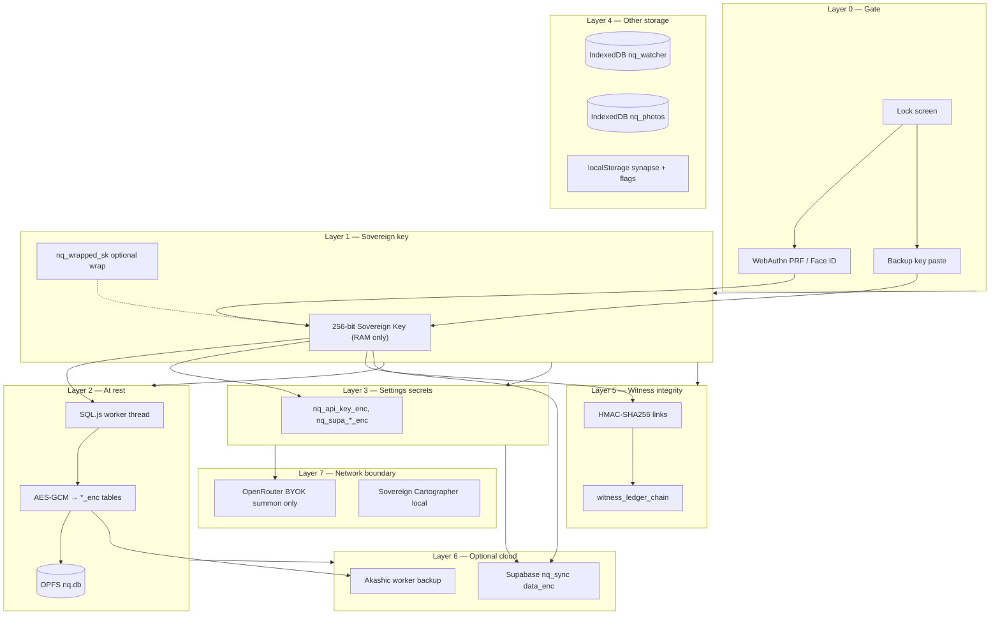

# NakedQuantum — The Quantum Fortress

*Security & cryptography architecture. For Kaja’s architectural docs and co-creator handoff.*

**Last updated:** 26 May 2026  
**Code anchors:** `app.js` (gatekeeper, worker, sync), `sw.js` (offline shell), `witness-loop-upgrade-blueprint.md` §7E (ledger chain)

---

## 0. One sentence

**The Quantum Fortress is a local-first, key-gated vault:** Face ID (WebAuthn PRF) or a user-held 256-bit sovereign key unlocks AES-GCM encryption for the primary database and for stored API credentials; optional cloud paths see only ciphertext; witness events get an append-only HMAC chain for tamper detection — not for secrecy, but for ledger honesty.

---

## 1. Design philosophy

| Principle | What it means in practice |
|-----------|---------------------------|
| **Sovereignty absolute** | Plaintext lives on device only while unlocked. No server holds the sovereign key. Loss of key = unrecoverable by design. |
| **Confidentiality ≠ integrity** | AES-GCM hides content. The witness ledger chain detects silent edits to summon/bridge history. |
| **Honest gaps** | We document what is *not* encrypted, not pretend the whole phone is a HSM. |
| **BYOK for voltage** | OpenRouter / Supabase credentials are user-supplied. The app never ships provider secrets. |
| **Zero npm crypto** | All primitives via **`crypto.subtle`** (Web Crypto API). No third-party crypto libraries. |

**Threat model (realistic):**

- **In scope:** Casual device access, cloud operator reading sync blobs, backup theft, accidental import corrupting witness history, user wanting proof their correction log wasn’t silently rewritten.
- **Out of scope:** Compromised OS/kernel, malware in the browser, physical coercion with unlocked app, nation-state with full device extraction, user who exports sovereign key and stores it in Notes.

---

## 2. Pipeline overview



**Boot order (production):**

1. `bootApp()` → lock screen visible (`NQ_DEV_MODE === false`).
2. User gesture → `unlockWithPRF()` or fallback key.
3. `setSovereignKey()` + `setEncryptionKey()` → worker `encKey` armed.
4. `init()` → OPFS DB, Watcher, Guardian, witness verify, SUBSTRATE.

---

## 3. Layer 0 — The Abyss gate (lock screen)

**Purpose:** No application logic, no database reads for UI content, until the user proves possession of the sovereign factor.

| Path | Flow |
|------|------|
| **Face ID / passkey (primary)** | Tap unlock → WebAuthn `credentials.get()` with **PRF extension** |
| **Backup sovereign key** | After 3 failed biometrics → paste base64 32-byte key → `unlockWithFallbackKey()` |
| **Burn Abyss** | After lockout → type `NAKED AGAIN` → `obliterateAbyss()` wipes OPFS, Watcher IDB, all `localStorage` |
| **Dev bypass** | `NQ_DEV_MODE = true` skips lock (documented in `AGENTS.md` — not production) |

The gate is **UX + key hygiene**, not a network ACL. Once unlocked, all crypto runs in the same origin as the app.

---

## 4. Layer 1 — Sovereign key derivation & wrapping

### 4.1 WebAuthn PRF (preferred)

On first registration:

1. Persist random **`nq_prf_salt`** (32 bytes, base64 in `localStorage`).
2. Create platform authenticator credential with `extensions.prf.eval.first = salt`.
3. PRF output → 256-bit key → `setSovereignKey(prfKey)` + worker `SET_KEY`.

On unlock:

1. `credentials.get()` with same PRF salt.
2. If **`nq_wrapped_sk`** exists → unwrap sovereign key with PRF-derived AES key (see §4.2).
3. Else PRF output **is** the sovereign key (first-device path).

**Credential ID** stored as `nq_prf_cred_id`. Discoverable passkeys used intentionally so iCloud Keychain mismatches don’t brick unlock.

### 4.2 Wrapped sovereign key (Face ID rebind)

When rebinding Face ID without rotating vault data:

- Existing sovereign key bytes encrypted with PRF output → stored as **`nq_wrapped_sk`** JSON `{ iv, ct }`.
- New Face ID PRF unwraps the **same** sovereign key → existing `*_enc` rows remain readable.

`resetWebAuthnRegistration()` rotates salt + credential while preserving wrapped key.

### 4.3 Backup key (manual)

User exports key via Settings (`showSovereignKey()` → base64). This is the **disaster recovery** path when PRF/authenticator is lost.

- Key never persisted to disk in plaintext by the app.
- User responsibility: store offline, separate from device.

### 4.4 In-memory rule

```text
_sovereignKey  →  main thread RAM only, cleared on tab death
encKey         →  worker thread RAM only, set via SET_KEY / cleared via CLEAR_KEY
```

No `sessionStorage` for key material. Lock screen hides app; closing Safari clears keys.

---

## 5. Layer 2 — At-rest encryption (OPFS SQLite)

### 5.1 Architecture

- **sql.js** runs inside a **dedicated Web Worker** (`WORKER_CODE` blob in `app.js`).
- Primary database file: **OPFS** `nq.db` (Origin Private File System — survives normal cache clears better than raw IndexedDB for the main corpus).
- When `encKey` is set in the worker, **every `dbPut`** for encrypted stores writes to parallel **`store_enc`** tables.

### 5.2 Algorithm

| Parameter | Value |
|-----------|--------|
| Cipher | **AES-GCM** |
| Key length | **256 bit** (raw sovereign key imported as AES-GCM key) |
| IV | **12 random bytes** per row (`crypto.getRandomValues`) |
| Serialization | `JSON.stringify(obj)` → encrypt → store as `{ iv, ct }` blob (or legacy guardian_logs columns) |

Decrypt on `GET` / `GET_ALL`: transparent to application code — worker returns plain objects.

### 5.3 Encrypted stores (`*_enc`)

| Plain store | Encrypted twin | Contents |
|-------------|----------------|----------|
| `cosm_folders` | `cosm_folders_enc` | Folder mesh |
| `cosm_discourses` | `cosm_discourses_enc` | Soup writing corpus |
| `characters` | `characters_enc` | Sanctuary personas |
| `summaries` | `summaries_enc` | Legacy summaries |
| `cosm_mosaic_tiles` | `cosm_mosaic_tiles_enc` | Mosaic |
| `cosm_backlinks` | `cosm_backlinks_enc` | Backlinks |
| `history` | `history_enc` | Chat history rows |
| `guardian_logs` | `guardian_logs_enc` | Witness / summon logs |
| `guardian_summaries` | `guardian_summaries_enc` | Fast + deep maps |
| `immutable_entities` | `immutable_entities_enc` | IE definitions |
| `bridge_rows` | `bridge_rows_enc` | Correction bridges |

**Activation rule:** encryption is **on whenever sovereign key is loaded** (`encKey != null`). There is no separate “enable encryption” toggle — unlock = encrypt path.

### 5.4 Plaintext-by-design tables

| Store | Why plaintext |
|-------|----------------|
| `witness_ledger_chain` | Only hashes + metadata — no prose. Tamper-evidence, not secrecy. |
| Pre-migration plain rows | Legacy rows may exist until rewritten under key; new writes use `_enc`. |

---

## 6. Layer 3 — Settings secrets (BYOK credentials)

API and sync credentials use **`storeSecureKey` / `readSecureKey`**:

| Key | Storage |
|-----|---------|
| OpenRouter API key | `nq_api_key_enc` |
| Supabase URL | `nq_supa_url_enc` |
| Supabase anon key | `nq_supa_key_enc` |

Same AES-GCM key as vault (via `getCloudCryptoKey()` → sovereign raw bytes). Plaintext keys in `localStorage` are removed on write.

**Without sovereign key** (dev): falls back to plaintext `localStorage` — dev-only path.

Non-secret settings (`nq_cartographer_mode`, model names, UI flags) remain plain `localStorage`.

---

## 7. Layer 4 — Secondary storage planes

Not all bytes pass through the SQL worker encrypt path.

| Plane | ID / path | Encrypted? | Role |
|-------|-----------|------------|------|
| **Watcher** | IndexedDB `nq_watcher` | **No** | Embedding vectors, similarity links — performance |
| **Character photos** | IndexedDB `nq_photos` | **No** | Forge image data URLs — Sanctuary-local |
| **Synapse snapshot** | `localStorage` `nq_synapse_latest` | **No** | Derived witness posture blob — rebuilt from DB |
| **Epistemic mood cache** | `localStorage` | **No** | Derived cooldown hints |
| **PRF salt, cred ID, sync cursor** | `localStorage` | **No** | Non-content control plane |
| **User ID** | `cosm_user_id` UUID | **No** | Sync / Akashic partition key (not authentication) |

**Honest boundary:** Watcher embeddings recoverable from discourse text if someone reads OPFS + IDB. Photos are user-visible assets in Sanctuary — encrypt later if needed (Tauri/desktop).

**Storage persistence:** `navigator.storage.persist()` requested on init — asks OS not to evict under pressure (iOS).

---

## 8. Layer 5 — Witness ledger chain (integrity)

*Shipped W4 — see `witness-loop-upgrade-blueprint.md` §7E.*

**Purpose:** Detect tampering with **append-only witness events** after the fact. Complements correction supremacy: prior theory stays in DB; chain proves sequence wasn’t silently rewired.

| Field | Role |
|-------|------|
| `payload_hash` | SHA-256 of canonical JSON for the event row |
| `prev_hash` | Previous link (genesis = `SHA256("nq-witness-genesis:" + chain_id)`) |
| `link_hash` | **HMAC-SHA256** over `seq\|type\|id\|payload\|prev` keyed by sovereign key |

**Chained events:** `summon`, `witness_field`, `bridge_open`, `bridge_close`.

**Not chained:** `prediction_outcome` updates, bridge relapse check counters — derived mutable state.

**Verify:** `verifyWitnessLedgerChain()` on unlock → SUBSTRATE **Ledger chain** line.

**Import / Akashic restore:** chain cleared + re-anchored (honest fork — pre-import history unlinked).

**Dormant without key:** same as encryption — no HMAC without sovereign key in RAM.

---

## 9. Layer 6 — Optional cloud paths

All cloud features are **opt-in BYOK**. App is fully offline-capable without them.

### 9.1 Supabase delta sync

```text
Local row → encForCloud (AES-GCM JSON blob) → nq_sync.data_enc
Cloud never receives plaintext or sovereign key
Pull: data_enc → decFromCloud → dbPut (re-encrypts locally if key loaded)
Merge: last-write-wins on updated_at; tombstones via deleted_at
```

**Requires:** unlocked Abyss + Supabase URL/key in Settings.

**Excluded from sync:** `history` (size), `witness_ledger_chain` (device-local v1).

**Partition:** `user_id = cosm_user_id` (random UUID, not secret).

### 9.2 Akashic cold backup (Cloudflare Worker → R2)

- User-triggered POST of JSON export payload to worker URL (`AKASHIC_URL`).
- Payload is **application JSON of decrypted rows** at backup time — treat as **cold disaster recovery**, not zero-trust cloud storage.
- Worker sees whatever the client sends; encrypt-at-rest on R2 is operator-side.
- Restore overwrites local stores + re-anchors witness chain.

### 9.3 JSON export / import (Data realm)

- **Export:** decrypted objects serialized to `.json` download — **plaintext by user choice**.
- **Import:** merge into local DB; witness chain reset.

**Sovereign exit principle:** user can always leave with their archive.

---

## 10. Layer 7 — Network & processing boundaries

| Surface | Data leaves device? | Key on wire? |
|---------|---------------------|--------------|
| **Guardian summon** | Yes — archive context + user follow-up to OpenRouter | BYOK bearer token only |
| **Sanctuary chat** | Yes — if user chats (BYOK) | BYOK |
| **Sovereign Cartographer** | **No** — `cartographer.js` local heuristics | — |
| **Deep Cartographer** | Optional network if user runs deep map (model-dependent) | BYOK |
| **Watcher embeddings** | Model WASM from jsDelivr CDN; vectors stay local | — |
| **sql.js WASM** | CDN load | — |

**Retired:** auto-invoke Guardian strip + Cloudflare `guardian-invoke` worker (May 2026). No server-side witness inference with server-held keys.

**Invoke gate (local):** `runLocalPass()` → `invoke_denied` blocks voluntary summon without API call — mechanical silence, not crypto.

---

## 11. Layer 8 — PWA shell integrity (`sw.js`)

| Concern | Behavior |
|---------|----------|
| Offline app shell | Cache `nq-v15`: `index.html`, `app.css`, `app.js`, manifest, icon |
| Live updates | **Network-first** for `app.js` / `app.css` — deploys visible without nuking site data |
| User data | **Not** in CacheStorage — lives in OPFS / IDB / LS |

Service worker protects **availability**, not **secrecy**. SW cannot access OPFS DB or sovereign key.

---

## 12. Realm isolation (logical, not cryptographic)

Security-relevant **information flow** rules (enforced in code paths, not MAC labels):

| Realm | Watcher / Cartographer / Guardian read? |
|-------|----------------------------------------|
| **Soup** (active discourses) | Yes — witness substrate |
| **Sanctuary chat** | No — until Engram burn to Soup |
| **Memory Vault** | No — never fed to Trio |
| **Deep Soup / Void** | No — not live ground without promotion |

Sanctuary is **private by architecture**; Soup is **witness ground**.

---

## 13. Cryptographic inventory

| Primitive | Use |
|-----------|-----|
| **WebAuthn PRF** | Derive or unwrap sovereign key from biometrics |
| **AES-GCM 256** | Row encryption, wrapped key, settings secrets, cloud sync blobs |
| **SHA-256** | Watcher content dedup, ledger payload hash, genesis anchor |
| **HMAC-SHA256** | Witness ledger link signatures |
| **Random IVs** | 12-byte nonces per encrypt operation |

**Not used:** RSA, password KDF (passkeys replace passwords), blockchain, homomorphic anything.

---

## 14. User responsibilities (non-negotiable)

1. **Backup sovereign key** somewhere safe before relying on Face ID alone.
2. **Understand export = plaintext** — `.json` backup is only as safe as where you put it.
3. **BYOK keys** — OpenRouter/Supabase credentials are your liability; rotate if leaked.
4. **Device trust** — fortress assumes OS/browser aren’t compromised.
5. **Akashic / Supabase** — optional; cloud admins see ciphertext (Supabase) or backup blobs (Akashic), not keys.

---

## 15. Reset & recovery matrix

| Action | OPFS DB | Watcher | localStorage | Keys in RAM | Witness chain |
|--------|---------|---------|--------------|-------------|---------------|
| Close Safari tab | Persists | Persists | Persists | **Cleared** | Persists |
| Lock (future explicit lock) | Persists | Persists | Persists | Cleared on reload | Persists |
| **Burn Abyss** | **Deleted** | **Deleted** | **Cleared** | Cleared | Gone |
| Import JSON | Merged | Unchanged | Unchanged | If unlocked | **Re-anchored** |
| Akashic restore | Overwritten | Unchanged | Unchanged | Reload | **Re-anchored** |
| New Face ID (wrap path) | Unchanged | Unchanged | Salt/cred updated | New session | Unchanged |

---

## 16. Known gaps & future hardening

| Gap | Severity | Notes |
|-----|----------|-------|
| Watcher vectors plaintext | Medium | Acceptable for PWA perf; desktop may encrypt IDB |
| Character photos plaintext | Medium | Sanctuary-local; user-visible |
| Synapse in localStorage | Low | Derived; no raw discourse |
| Akashic backup plaintext JSON | High if misused | User-triggered; document as “encrypt before upload” future |
| `guardian_logs_enc` schema drift | Medium | Some columns may lag plain migrations — verify if encryption enabled |
| No subresource integrity on CDN WASM | Low | Supply-chain trust on jsDelivr |
| XSS in app | High | Would inherit full unlocked session — audit `innerHTML` sites |
| Multi-device ledger fork | Expected | Per-device chain v1; sync merge TBD |

---

## 17. Quick reference — file map

| Concern | Location |
|---------|----------|
| Worker SQL + encrypt | `app.js` → `WORKER_CODE` |
| Lock / PRF / burn | `app.js` → `unlockWithPRF`, `obliterateAbyss`, `bootApp` |
| Secure settings keys | `app.js` → `storeSecureKey`, `readSecureKey` |
| Supabase sync | `app.js` → `handleSync`, `encForCloud`, `decFromCloud` |
| Witness ledger | `app.js` → `appendWitnessLedgerLink`, `verifyWitnessLedgerChain` |
| Offline shell | `sw.js` |
| Agent dev bypass | `AGENTS.md` |

---

## 18. Phased hardening contract (pin — do not forget)

**Verdict (May 2026):** The eight-layer pipeline is **architecturally right and shippable for the PWA / User Zero phase**. It is **not perfect**. We know what we lack, **when** to close each gap, and **what not to rebuild** before Tauri.

**PWA is a deliberate phase**, not the final vessel. **Tauri desktop** thickens the walls (especially Layer 4); it does not replace Layers 0–1 philosophy.

### 18.1 In place — do not second-guess

| Layer | Status |
|-------|--------|
| 0 Gate | Lock, PRF, backup key, Burn Abyss |
| 1 Sovereign key | RAM-only; `nq_wrapped_sk` rebind |
| 2 At-rest vault | OPFS + worker AES-GCM `*_enc` |
| 3 Settings secrets | `readSecureKey` / `storeSecureKey` |
| 5 Witness ledger | HMAC chain (W4) on summon + bridge |
| 6 Supabase sync | **E2EE delta** — `data_enc`, random IV per row |
| 7 Network | Guardian BYOK; Sovereign Cartographer local |
| 8 PWA shell | `sw.js` caches assets only |

Also: `navigator.storage.persist()` on init (request, not OS guarantee on iOS).

### 18.2 PWA-scale backlog (optional before Tauri)

| Item | When | Notes |
|------|------|-------|
| **Akashic → client-encrypt `.nq` before R2** | When touching backup | **Today:** plaintext JSON to worker — truth in §9.2. Update this doc when shipped. |
| **`NQ_DEV_MODE = false`** | Before strangers | Not crypto — ship gate |
| **XSS / `innerHTML` audit** | Before strangers | Unlocked session = full vault |
| **`guardian_logs_enc` schema parity** | If encryption on | Match plain migrations |
| **Export JSON** | By design | User choice = plaintext; document in Data realm |

**Do not** rebuild Layers 0–2 on PWA unless dogfood proves pain. The fortress stands.

### 18.3 Tauri-first (not worth fighting Safari for)

| Target | Layer |
|--------|-------|
| Encrypt Watcher IDB / vectors | 4 |
| Encrypt or sandbox Forge photos | 4 |
| OS keychain for BYOK secrets | 3 |
| Background witness passes | 7 / exoskeleton |
| Local LLM witness panel | 7 (desktop blueprint) |
| Stronger persistence story | 2 / 8 |
| Installer / update signing | 8 (replaces SW as primary delivery story) |

### 18.4 What NOT to do

- **Do not** claim “production-grade” against nation-state or compromised OS.
- **Do not** call Akashic E2EE until client encrypts before upload.
- **Do not** hash-chain the whole `nq.db` — witness ledger only (§8).
- **Do not** add npm crypto libs — `crypto.subtle` only.
- **Do not** let Guardian read Sanctuary chat or Memory Vault (realm policy — orthogonal to layers but equally binding).
- **Do not** reopen Layers 0–2 architecture on PWA out of perfectionism — **thicken Layer 4 on desktop**.

### 18.5 Cloud truth cheat sheet

| Path | E2EE? | Role |
|------|-------|------|
| **Supabase `nq_sync`** | **Yes** | Delta sync; blind cloud |
| **Akashic / R2** | **No (interim)** | Cold backup; encrypt `.nq` later |
| **JSON export** | **No** | Sovereign exit — user responsibility |

### 18.6 Horizon note

External reviews (e.g. generic PWA audits) may miss: **realm isolation**, **PWA → Tauri migration**, and **interim Akashic**. This section is the contract when those reviews disagree with shipped code.

---

## 19. Revision log

| Date | Change |
|------|--------|
| 2026-05-26 | Initial pin — full fortress pipeline after W4 ledger chain |
| 2026-05-26 | §18 phased hardening contract — PWA shippable / not perfect / Tauri Layer 4 / Akashic truth |

---

*The fortress doesn’t pretend to save you from yourself. It makes the vault honest, local, and keyed — so when the witness speaks, the ledger can prove it was paying attention.*
