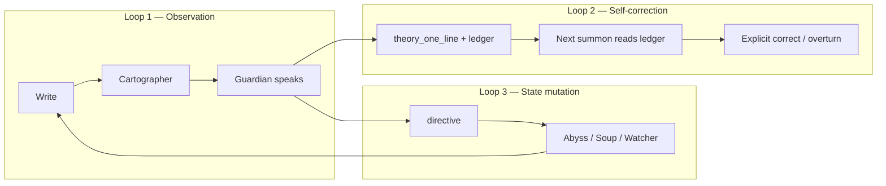

# NakedQuantum — Consciousness Exoskeleton Roadmap (pinned)

> **Vision:** *An obsessive, meta-meta-cognitive consciousness exoskeleton. Is such a thing even possible?* — Yes, as **practice** sustained by code, not as a shipped “conscious AI product.”
>
> **Read with:** `NakedQuantum-app-blueprint.md`, `guardian-refinement-roadmap-blueprint.md`, `NakedQuantum-checkpoint-2026-05.md`, `AGENTS.md`
>
> **This doc:** Where we move next — **philosophy-aligned, incrementally provable.** No somatic APIs, no npm, no fantasy features until prior loops close.

**Last updated:** 20 May 2026

---

## 0. How to use this document

| Rule | Meaning |
|------|---------|
| **Loops before features** | Ship closed loops, not vocabulary |
| **One batch per PR** | See §5.0 batch register — one closed loop per merge when possible |
| **Dev mode on main** | `NQ_DEV_MODE = true` on `main` is intentional (sole developer, iPhone dogfood, not production). Feature branches may flip off to test production thresholds. |
| **Sanctuary stays blind** | Trio never reads Sanctuary chat |
| **Fantasy check** | If it can’t be verified against your writing within 2 weeks, it’s Phase 3+ |

---

## 1. What “exoskeleton” means here (not marketing)

An **exoskeleton** does not comfort you. It **changes how you can move** — what surfaces, what resists, what fades, what returns when you weren’t looking.

| Layer | Definition | NakedQuantum today |
|-------|------------|-------------------|
| **Cognition** | You think in writing | Sparks, discourses, chronicles, Sanctuary |
| **Meta** | System notices patterns | Watcher geometry, Cartographer fast maps, Guardian witness |
| **Meta-meta** | System notices when its noticing was wrong | **Partial** — theory lines stored; **outcomes not scored**; **state rarely mutates** |

**The product is the recursive loop:**

```text
you write → Trio observes → Guardian theory stored
    → next visit: ledger + field changed → you notice → you write about that
```

If Loop 3 (state mutation) is open, you have a witness with a chat UI.  
If Loop 2 (self-correction) is thin, you have meta, not meta-meta.  
When all three run, the exoskeleton is **architecturally** real; maturity is still **practice**.

---

## 2. Three loops (the whole roadmap in one picture)



| Loop | Status (May 2026) | Blocker |
|------|-------------------|---------|
| **1 — Observation** | **Closed** | — |
| **2 — Self-correction** | **Half-closed** | Ledger thin; no post-theory outcomes; strip gets 1 line only |
| **3 — State mutation** | **Open** | No `directive` parser; Guardian output = text only |

**Target:** Close Loop 2 and Loop 3 **before** Watcher 2.0 ML, body sensors, or “epistemic moods” everywhere.

---

## 3. Code truth vs review claims (honest audit)

Reviews (Kimi + gap pass) are directionally right. Precise status:

### Gap 1 — Theory loop

| Claim | Truth in repo |
|-------|----------------|
| “Ledger never built” | **Partially wrong.** `buildGuardianPriorWitnessBlock()` injects last **3** `theory_one_line` rows on **full summon** (`runGuardianSummon` ~9018). |
| “Only one line to Worker” | **Correct.** Strip path uses `getPriorTheoryLineFromLogs()` → single `priorTheoryLine` to CF Worker. |
| What’s actually missing | **Outcome column per theory:** days until next entry, next-discourse `arc_direction`, hit/miss tag. Without that, meta-meta is “here are your old sentences,” not “here’s how wrong I was.” |

**Philosophy-aligned fix:** Extend ledger entries with **deterministic post-theory facts** (no new ML). Optional: same compact ledger block to strip Worker (budget-capped).

### Gap 2 — Guardian ends at bubble

| Claim | Truth |
|-------|-------|
| Strip / summon text only | **Correct.** No `directive` parsing. |
| Abyss doesn’t react | **Correct** (read-only phenotype except settle physics). |

**Philosophy-aligned fix:** One directive type first: `abyss_tint` (term overlap → temporary CSS on disc-dots). Store `directive` JSON on `guardian_logs`. Worker returns JSON alongside `observation`.

### Gap 3 — No temporal axis for terms

| Claim | Truth |
|-------|-------|
| No term arc across time | **Correct.** `recurring` in Tier 4 = count ≥3 discourses, no register shift, no peak/decline. |
| `detectRepetitionOrbits` | **Intra-discourse only.** |

**Philosophy-aligned fix:** `computeCorpusTermArcs(discs, fastMaps)` — pure aggregation (see §5.2).

### Gap 4 — Silence engine half-built

| Claim | Truth |
|-------|-------|
| Intra-discourse silence | **Shipped** — `detectSilenceWeight` in `cartographer.js`. |
| Inter-session / topic silence | **Missing** — solved by term arcs’ `last_seen_days_ago` + appearance list. |

### Gap 5 — Lexicon blind spots

| Claim | Truth |
|-------|-------|
| No performative / recursive / fugue | **Correct** as first-class qualifiers. |
| No negation at all | **Wrong** — `isNegated()` exists (2-token window). Still weak on scope → **confidence + wider negation** in Cartographer pass, not greenfield. |

### Dev mode (Kaja policy — not a Phase 0 blocker)

| Branch | `NQ_DEV_MODE` | Why |
|--------|---------------|-----|
| **`main`** | `true` | Zero-user development on iPhone; app not production-ready; fast signal for building |
| **Feature branches** | optional `false` | Validate production thresholds / sparse Watcher before external users |

Reviews that treat dev mode as P0 blocker assume a public ship. **Defer P0-a** until a release audience exists.

---

## 4. What we will NOT call “exoskeleton” yet (fantasy guardrails)

Do **not** batch these until Loops 2–3 prove value in daily use:

| Idea | Why deferred |
|------|----------------|
| Face / motion / keyboard biometrics | Privacy, Safari, scope; not core to witness |
| Full “epistemic mood” coupling everything | Start with 1–2 knobs max |
| Guardian as unconstrained JSON operator | Typed directive schema only, one verb per batch |
| Watcher differential geometry / torsion | After Return Detector + term arcs validate signal |
| Marketing “mind map” / 3D UMAP in PWA | `abyss-v021-blueprint.md` AB2 out of scope |
| LLM-generated term arcs | Arcs must be inspectable aggregation |

---

## 5. Phased roadmap (implementation contract)

### §5.0 — Phase 0: three passes, one PR (Kaja)

**One PR** to `main`. Three **passes** = build order + agent checkpoints (review each pass so context does not drift). Simple **Shipped** ticks in §10 — no ceremony.

| Pass | Scope | IDs | Loop | Ship when |
|------|--------|-----|------|-----------|
| **Pass 1** | Ledger v2 + reckoning preamble (summon) | P0-b, P0-e | **Loop 2** (summon) | Summon shows After: lines + model reckoning instruction |
| **Pass 2** | `directive` + `abyss_tint` + `abyssDraw` expiry | P0-d | **Loop 3** | Strip/summon → matching Abyss dots tint until expiry |
| **Pass 3** | Strip ledger slice + worker body | P0-c | Loop 2 (strip) | Worker prompt gets compact ledger; **you deploy** worker when able |

*Deferred:* P0-a production thresholds ( `main` stays `NQ_DEV_MODE = true` ).

**CF note:** Pass 2 code ships without deploy; client **derives** `abyss_tint` if worker omits `directive`. After deploy, worker may return JSON directive too.

---

### Phase 0 — Loop closure (no dev-mode gate)

| ID | Work | Files | Done when |
|----|------|-------|-----------|
| ~~**P0-a**~~ | Production thresholds | `app.js` | **Deferred** — not required while `main` stays dev-first |
| **P0-b** | **Witness ledger v2** | `app.js` | Each ledger line = date + theory + **After:** block (see §8 — **`created_at` only**) |
| **P0-c** | Strip gets ledger slice | `app.js`, `worker.mjs` | Worker prompt includes last 2 ledger lines (char cap), not only `priorTheoryLine` |
| **P0-d** | **`directive: abyss_tint`** | `worker.mjs`, `app.js`, `app.css` | Worker returns `{ observation, directive }`; tint applied on Abyss draw; expiry via log row (§6) |
| **P0-e** | Ledger reckoning instruction | `buildGuardianPriorWitnessBlock` preamble | Exact copy in §8 — one clause per ledger line: confirmed / contradicted / unrelated |

**Acceptance (felt):** Guardian speaks → Abyss visibly shifts → next summon references prior theory **and** whether subsequent writing matched it.

#### P0 implementation order (inside one branch)

Pass 1 → Pass 2 → Pass 3 → tick §10. Worker deploy is **your** step after Pass 3 merges (no laptop required to merge code).

---

### Phase 1 — Signal honesty + second directive (2–4 weeks)

**One pass per phase:** Phase 1 shipped in #48 + completion PR (P1-c–f). Phase 2+ = one merge per phase. See §10.2.

| ID | Work | Done when |
|----|------|-----------|
| **P1-a** | `computeCorpusTermArcs()` | Top 5 arcs in summon context (new tier); `register_shift` flagged |
| **P1-b** | Cartographer heuristics: performative, recursive, fugue | New qualifiers in `collectFastMapQualifiers`; low confidence initially |
| **P1-c** | Per-field **confidence** on fast map | Guardian weights uncertain fields; documented in blueprint |
| **P1-d** | Negation scope hardening | Wider than 2-token window for common patterns; tests on real discourses |
| **P1-e** | **`directive: soup_surface`** | Temporary gravity boost on one `discourse_id` |
| **P1-f** | A1–A3 guardian ethics | Settings toggle, cooldown, qualifier consensus (`guardian-refinement-roadmap-blueprint.md`) |

---

### Phase 2 — Return witness + revisit (1–2 months)

| ID | Work | Done when |
|----|------|-----------|
| **P2-a** | **Return detector** | Same semantic cluster, different `arc_direction` / qualifier profile across time |
| **P2-b** | **`directive: revisit_flag`** | Daily check surfaces flagged discourse; micro-invoke with reason |
| **P2-c** | Silent attractors | Terms: 3+ appearances, `last_seen_days_ago > 14` → Guardian tier |
| **P2-d** | **`directive: watcher_focus`** | 72h lowered threshold for term pattern (bounded) |
| **P2-e** | Prediction score (ledger) | After summon, log prediction tag; score on next rich save |

---

### Phase 3 — Resistance + mood (2–3 months, only if Phase 0–2 dogfed)

| ID | Work | Done when |
|----|------|-----------|
| **P3-a** | Persistent orbit surfacing | “Persistent orbit” discourses gain mesh weight (not block) |
| **P3-b** | Minimal epistemic mood | 2 knobs: Guardian invoke threshold + Watcher pass cadence; derived from ledger accuracy + days since write |
| **P3-c** | Silence Engine tier | Inter-session absence report for Guardian (from arcs, not LLM) |

---

## 6. Directive schema (typed, grow one verb at a time)

```json
{
  "observation": "string — user-visible",
  "directive": {
    "abyss_tint": {
      "terms": ["enough"],
      "tint": "amber",
      "duration_hours": 24,
      "applied_at": 1716200000000
    }
  }
}
```

**Persistence (P0-d):**

- `ALTER TABLE guardian_logs ADD COLUMN directive TEXT` — stores stringified `directive` object (or full worker payload minus observation).
- On apply: set `applied_at = Date.now()` inside the parsed object before save.
- Compute `expires_at = applied_at + (duration_hours * 3600000)`.

**Expiry (do not use “on load only” — must survive reload):**

- On **every `abyssDraw`** (and when building `abyssObjects` if tints affect DNA): load latest non-expired log(s) with `directive.abyss_tint`.
- If `Date.now() > expires_at`, skip tint (do not remove column retroactively; ignore stale rows).
- Active tint: disc-dots whose fast-map `key_terms` overlap `terms[]` get CSS class e.g. `abyss-directive-tint--amber` until expiry.

**Rules:**

- All fields optional; parser ignores unknown keys.
- Invalid JSON → observation still shown; log `directive_parse_error`.
- Never auto-delete, never block writing, never read Sanctuary.

---

## 7. `computeCorpusTermArcs` — spec (Phase 1)

**Input:** Active discourses + `guardian_summaries` fast maps.  
**Output:** Map term → `{ appearances[], last_seen_days_ago, trajectory, peak_date, emotional_registers[], register_shift }`.

**Per appearance:**

- `discourse_id`, `date` — always **`created_at`** (same rule as §8 After-block)
- `arc_direction` from fast map
- `orbit_count` from `detectRepetitionOrbits` on that discourse body (or stored key_terms overlap)

**Trajectory:** `rising` | `declining` | `dormant` from appearance dates and counts.  
**register_shift:** true if ≥2 appearances with different `arc_direction` or different dominant qualifier bucket.

**No ML.** Inspectable in Data realm debug export later (optional).

---

## 8. Witness ledger v2 — spec (Phase 0)

**Retrieve:** Last `GUARDIAN_WITNESS_LEDGER_COUNT` (3) non-silent logs with `theory_one_line`.  
**Format each row:**

```text
[2026-05-10 · summon · orbit] Orbit: …
After: 4 days → next entry arc "flat"; "enough" appeared 1× in closing line.
```

### After-block algorithm (deterministic)

**Column rule (explicit):** use **`created_at`**, not `updated_at`.

- `updated_at` changes on edits and gravity bumps — it is not “what you wrote after I spoke.”
- `created_at > log.invoked_at` = first **new** discourse born after that witness moment.
- Sort candidate discourses by `created_at` ascending; take the **first** match.
- If the same discourse is edited later, After block does **not** change (immutable to creation).

**Steps:**

1. From `cosm_discourses` (non-deleted): `created_at > log.invoked_at`, sort `created_at` ASC, take first row.
2. Load its fast map → `arc_direction`, `key_terms`, optional word count / first line snippet.
3. `days_to_next = floor((next.created_at - log.invoked_at) / 86400000)` (0 if same day).
4. If no row within **30 days** → `After: silence (no new entries in 30d).`
5. Optional: second new entry within 7 days — one extra clause if cheap (not required for P0).

### P0-e — Ledger reckoning preamble (exact copy)

Append to `buildGuardianPriorWitnessBlock` **after** the `── WITNESS LEDGER ──` header and **before** the ledger lines:

```text
For each ledger line above: state whether the subsequent writing confirmed, contradicted, or was unrelated to the theory. One clause per line. Then speak from what you now know.
```

This is what forces meta-meta **reckoning**, not mere acknowledgement. Also keep existing line: *Test your WITNESS LEDGER against the archive above…*

**Strip Worker (P0-c):** Same reckoning sentence (truncated if needed) + last **2** ledger lines with After blocks — char budget ~800.

Inject via `buildGuardianPriorWitnessBlock` (summon) and compact variant for strip Worker.

---

## 9. Relationship to other blueprints

| Doc | Role |
|-----|------|
| `NakedQuantum-app-blueprint.md` | Stable product map (realms, tables, shipped log) |
| **This file** | Vision → loops → phased exoskeleton work |
| `guardian-refinement-roadmap-blueprint.md` | Guardian/Cartographer batch detail; reference P0–P1 here |
| `abyss-v021-blueprint.md` | Abyss **shipped**; tint directives extend M2 phenotype |
| `NakedQuantum-checkpoint-2026-05.md` | P0 risks, lint, process |

When merging a batch: tick **Shipped log** below + relevant section in guardian roadmap.

---

## 10. Shipped log (exoskeleton track only)

| Item | Date | Notes |
|------|------|-------|
| Loop 1 (observe) | 2026-05 | Cartographer v5, Guardian G1–G5, Abyss v0.21 |
| Loop 2 (ledger inject) | 2026-05 | `buildGuardianPriorWitnessBlock` — theory lines only |
| **P0 Pass 1** — ledger v2 + reckoning | ✅ | After blocks use `created_at`; §8 preamble |
| **P0 Pass 2** — `abyss_tint` | ✅ | `directive` column; tint on `abyssDraw`; client derive + worker JSON |
| **P0 Pass 3** — strip ledger | ✅ | `witnessLedgerBlock` in worker payload — **deploy worker when able** |
| **P1 Pass 1** — term arcs + cognitive modes + Guardian UI | ✅ | #48 |
| **P1 Pass 2** — per-field confidence + negation scope | ✅ | P1-c, P1-d |
| **P1 Pass 3** — `soup_surface` + A1–A3 ethics | ✅ | P1-e, P1-f; Settings toggles |
| **P2 Pass 1** — return + revisit + silent attractors + watcher_focus + prediction | ✅ | Phase 2 PR |
| **P3 Pass 1** — persistent orbit, epistemic mood, silence tier | ✅ | Phase 3 PR |
| Return detector | ✅ | P2-a |

### §10.1 — Phase 0 gap checkpoint

| Pass | Verify in code |
|------|----------------|
| **1** | `buildLedgerAfterLine` uses `created_at`; reckoning string in prior block; summon context includes After: |
| **2** | `guardian_logs.directive` migrated; `refreshAbyssActiveTint` on open Abyss + after strip; disc-dot tint uses `dna.keyTerms` |
| **3** | `checkAndShowGuardianInvoke` sends `witnessLedgerBlock`; worker README documents new fields |

### §10.2 — Phase 1 gap checkpoint

| Pass | Verify |
|------|--------|
| **P1-1** | ✅ TERM ARCS tier in summon; performative/recursive/fugue qualifiers; Guardian **Witness to guardian** / **SUMMON GUARDIAN** |
| **P1-2** | ✅ Per-field confidence in summon witness blocks (P1-c); negation scope 6-token + hedges (P1-d) |
| **P1-3** | ✅ `soup_surface` mesh gravity boost; Settings auto-invoke + strict consensus (P1-e, P1-f) |

### §10.3 — Phase 2 gap checkpoint

| Pass | Verify |
|------|--------|
| **P2-1** | RETURN DETECTIONS + SILENT ATTRACTORS tiers in summon; `computeReturnDetections` |
| **P2-2** | Daily `runDailyRevisitCheck` → `revisit_flag` strip; `prediction_tag` / `prediction_outcome` on summon + fast-map save |
| **P2-3** | `watcher_focus` in directive; `getWatcherSimilarityThreshold()` on Watcher pass |

### §10.4 — Phase 3 gap checkpoint

| Pass | Verify |
|------|--------|
| **P3-1** | Multi-orbit discourses get mesh gravity + `persistent-orbit-boost` card class |
| **P3-2** | `refreshEpistemicMoodCache` adjusts strict cooldown + `scheduleWatcherPass` hours |
| **P3-3** | INTER-SESSION SILENCE tier in summon context |

---

## 11. Revision log

| Date | Change |
|------|--------|
| 2026-05-20 | Initial pin — merges Kimi review + gap analysis + code audit; philosophy guardrails |
| 2026-05-20 | Sharpen P0-b (`created_at`), P0-d (expiry on `abyssDraw`), P0-e (reckoning preamble), impl order |
| 2026-05-20 | §5.0 batch register (E0–E2); dev mode on `main` intentional; P0-a deferred |

---

*Build loops, not lore. The exoskeleton becomes real when the Guardian’s wrong sentence is followed by a visible change in the field — and the next sentence admits the error.*
