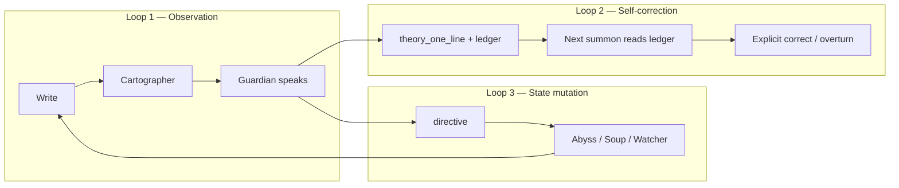

# NakedQuantum — Consciousness Exoskeleton Roadmap (pinned)

> **Vision:** *An obsessive, meta-meta-cognitive consciousness exoskeleton. Is such a thing even possible?* — Yes, as **practice** sustained by code, not as a shipped “conscious AI product.”
>
> **Read with:** `NQ blueprint.md` (what exists), `guardian-refinement-roadmap-blueprint.md`, `nq-review-checkpoint-2026-05.md`, `AGENTS.md`
>
> **This doc:** Where we move next — **philosophy-aligned, incrementally provable.** No somatic APIs, no npm, no fantasy features until prior loops close.

**Last updated:** 20 May 2026

---

## 0. How to use this document

| Rule | Meaning |
|------|---------|
| **Loops before features** | Ship closed loops, not vocabulary |
| **One batch per PR** | Each phase item = one blueprint tick + one merge |
| **Dogfood gate** | `NQ_DEV_MODE = false` before judging any signal layer |
| **Sanctuary stays blind** | Trio never reads Sanctuary chat |
| **Fantasy check** | If it can’t be verified against your writing within 2 weeks, it’s Phase 3+ |

---

## 1. What “exoskeleton” means here (not marketing)

An **exoskeleton** does not comfort you. It **changes how you can move** — what surfaces, what resists, what fades, what returns when you weren’t looking.

| Layer | Definition | NakedQuantum today |
|-------|------------|-------------------|
| **Cognition** | You think in writing | Sparks, discourses, chronicles, Sanctuary |
| **Meta** | System notices patterns | Watcher geometry, Cartographer fast maps, Guardian witness |
| **Meta-meta** | System notices when its noticing was wrong | **Partial** — theory lines stored; **outcomes not scored**; **state rarely mutates** |

**The product is the recursive loop:**

```text
you write → Trio observes → Guardian theory stored
    → next visit: ledger + field changed → you notice → you write about that
```

If Loop 3 (state mutation) is open, you have a witness with a chat UI.  
If Loop 2 (self-correction) is thin, you have meta, not meta-meta.  
When all three run, the exoskeleton is **architecturally** real; maturity is still **practice**.

---

## 2. Three loops (the whole roadmap in one picture)



| Loop | Status (May 2026) | Blocker |
|------|-------------------|---------|
| **1 — Observation** | **Closed** | — |
| **2 — Self-correction** | **Half-closed** | Ledger thin; no post-theory outcomes; strip gets 1 line only |
| **3 — State mutation** | **Open** | No `directive` parser; Guardian output = text only |

**Target:** Close Loop 2 and Loop 3 **before** Watcher 2.0 ML, body sensors, or “epistemic moods” everywhere.

---

## 3. Code truth vs review claims (honest audit)

Reviews (Kimi + gap pass) are directionally right. Precise status:

### Gap 1 — Theory loop

| Claim | Truth in repo |
|-------|----------------|
| “Ledger never built” | **Partially wrong.** `buildGuardianPriorWitnessBlock()` injects last **3** `theory_one_line` rows on **full summon** (`runGuardianSummon` ~9018). |
| “Only one line to Worker” | **Correct.** Strip path uses `getPriorTheoryLineFromLogs()` → single `priorTheoryLine` to CF Worker. |
| What’s actually missing | **Outcome column per theory:** days until next entry, next-discourse `arc_direction`, hit/miss tag. Without that, meta-meta is “here are your old sentences,” not “here’s how wrong I was.” |

**Philosophy-aligned fix:** Extend ledger entries with **deterministic post-theory facts** (no new ML). Optional: same compact ledger block to strip Worker (budget-capped).

### Gap 2 — Guardian ends at bubble

| Claim | Truth |
|-------|-------|
| Strip / summon text only | **Correct.** No `directive` parsing. |
| Abyss doesn’t react | **Correct** (read-only phenotype except settle physics). |

**Philosophy-aligned fix:** One directive type first: `abyss_tint` (term overlap → temporary CSS on disc-dots). Store `directive` JSON on `guardian_logs`. Worker returns JSON alongside `observation`.

### Gap 3 — No temporal axis for terms

| Claim | Truth |
|-------|-------|
| No term arc across time | **Correct.** `recurring` in Tier 4 = count ≥3 discourses, no register shift, no peak/decline. |
| `detectRepetitionOrbits` | **Intra-discourse only.** |

**Philosophy-aligned fix:** `computeCorpusTermArcs(discs, fastMaps)` — pure aggregation (see §5.2).

### Gap 4 — Silence engine half-built

| Claim | Truth |
|-------|-------|
| Intra-discourse silence | **Shipped** — `detectSilenceWeight` in `cartographer.js`. |
| Inter-session / topic silence | **Missing** — solved by term arcs’ `last_seen_days_ago` + appearance list. |

### Gap 5 — Lexicon blind spots

| Claim | Truth |
|-------|-------|
| No performative / recursive / fugue | **Correct** as first-class qualifiers. |
| No negation at all | **Wrong** — `isNegated()` exists (2-token window). Still weak on scope → **confidence + wider negation** in Cartographer pass, not greenfield. |

### P0 — Dev mode (all reviews agree)

`NQ_DEV_MODE = true` → Watcher/Abyss/Guardian train on **noise**. Not a philosophical debate; flip for dogfood.

---

## 4. What we will NOT call “exoskeleton” yet (fantasy guardrails)

Do **not** batch these until Loops 2–3 prove value in daily use:

| Idea | Why deferred |
|------|----------------|
| Face / motion / keyboard biometrics | Privacy, Safari, scope; not core to witness |
| Full “epistemic mood” coupling everything | Start with 1–2 knobs max |
| Guardian as unconstrained JSON operator | Typed directive schema only, one verb per batch |
| Watcher differential geometry / torsion | After Return Detector + term arcs validate signal |
| Marketing “mind map” / 3D UMAP in PWA | `abyss-v021-blueprint.md` AB2 out of scope |
| LLM-generated term arcs | Arcs must be inspectable aggregation |

---

## 5. Phased roadmap (implementation contract)

### Phase 0 — Discipline + loop closure (1–2 weeks)

**Gate:** `NQ_DEV_MODE = false` (or Settings: “Production thresholds”) before measuring anything below.

| ID | Work | Files | Done when |
|----|------|-------|-----------|
| **P0-a** | Production thresholds live | `app.js` | Watcher silent period, 0.73 similarity, 20h pass, no fake strip in dev |
| **P0-b** | **Witness ledger v2** | `app.js` | Each ledger line = date + theory + **after:** `{days_to_next, next_arc, word_delta}` from SQL discourses after `invoked_at` |
| **P0-c** | Strip gets ledger slice | `app.js`, `worker.mjs` | Worker prompt includes last 2 ledger lines (char cap), not only `priorTheoryLine` |
| **P0-d** | **`directive: abyss_tint`** | `worker.mjs`, `app.js`, `app.css` | Worker may return `{ observation, directive }`; app applies tint to Abyss dots with `key_terms` overlap; persist `directive` on log; expires in 24h |
| **P0-e** | Summon calibration line | `GUARDIAN_SYSTEM_PROMPT` / prior block | Model instructed to **test** ledger and name which prior theory failed |

**Acceptance (felt):** Guardian speaks → Abyss visibly shifts → next summon references prior theory **and** whether subsequent writing matched it.

---

### Phase 1 — Signal honesty + second directive (2–4 weeks)

| ID | Work | Done when |
|----|------|-----------|
| **P1-a** | `computeCorpusTermArcs()` | Top 5 arcs in summon context (new tier); `register_shift` flagged |
| **P1-b** | Cartographer heuristics: performative, recursive, fugue | New qualifiers in `collectFastMapQualifiers`; low confidence initially |
| **P1-c** | Per-field **confidence** on fast map | Guardian weights uncertain fields; documented in blueprint |
| **P1-d** | Negation scope hardening | Wider than 2-token window for common patterns; tests on real discourses |
| **P1-e** | **`directive: soup_surface`** | Temporary gravity boost on one `discourse_id` |
| **P1-f** | A1–A3 guardian ethics | Settings toggle, cooldown, qualifier consensus (`guardian-refinement-roadmap-blueprint.md`) |

---

### Phase 2 — Return witness + revisit (1–2 months)

| ID | Work | Done when |
|----|------|-----------|
| **P2-a** | **Return detector** | Same semantic cluster, different `arc_direction` / qualifier profile across time |
| **P2-b** | **`directive: revisit_flag`** | Daily check surfaces flagged discourse; micro-invoke with reason |
| **P2-c** | Silent attractors | Terms: 3+ appearances, `last_seen_days_ago > 14` → Guardian tier |
| **P2-d** | **`directive: watcher_focus`** | 72h lowered threshold for term pattern (bounded) |
| **P2-e** | Prediction score (ledger) | After summon, log prediction tag; score on next rich save |

---

### Phase 3 — Resistance + mood (2–3 months, only if Phase 0–2 dogfed)

| ID | Work | Done when |
|----|------|-----------|
| **P3-a** | Persistent orbit surfacing | “Persistent orbit” discourses gain mesh weight (not block) |
| **P3-b** | Minimal epistemic mood | 2 knobs: Guardian invoke threshold + Watcher pass cadence; derived from ledger accuracy + days since write |
| **P3-c** | Silence Engine tier | Inter-session absence report for Guardian (from arcs, not LLM) |

---

## 6. Directive schema (typed, grow one verb at a time)

```json
{
  "observation": "string — user-visible",
  "directive": {
    "abyss_tint": { "terms": ["enough"], "tint": "amber", "duration_hours": 24 },
    "soup_surface": { "discourse_id": "uuid", "duration_hours": 48, "reason": "contradiction_unresolved" },
    "watcher_focus": { "terms": ["father"], "threshold_delta": -0.08, "duration_hours": 72 },
    "revisit_flag": { "discourse_id": "uuid", "days": 3, "reason": "escalation_unclosed" }
  }
}
```

**Rules:**

- All fields optional; parser ignores unknown keys.
- Invalid JSON → observation still shown; log `directive_parse_error`.
- Never auto-delete, never block writing, never read Sanctuary.

---

## 7. `computeCorpusTermArcs` — spec (Phase 1)

**Input:** Active discourses + `guardian_summaries` fast maps.  
**Output:** Map term → `{ appearances[], last_seen_days_ago, trajectory, peak_date, emotional_registers[], register_shift }`.

**Per appearance:**

- `discourse_id`, `date` (`created_at` or `updated_at` policy — pick one, document it)
- `arc_direction` from fast map
- `orbit_count` from `detectRepetitionOrbits` on that discourse body (or stored key_terms overlap)

**Trajectory:** `rising` | `declining` | `dormant` from appearance dates and counts.  
**register_shift:** true if ≥2 appearances with different `arc_direction` or different dominant qualifier bucket.

**No ML.** Inspectable in Data realm debug export later (optional).

---

## 8. Witness ledger v2 — spec (Phase 0)

**Retrieve:** Last `GUARDIAN_WITNESS_LEDGER_COUNT` (3) non-silent logs with `theory_one_line`.  
**Format each row:**

```text
[2026-05-10 · summon · orbit] Orbit: …
After: 4 days → next entry arc "flat"; "enough" appeared 1× in closing line.
```

**After-block algorithm (deterministic):**

1. Find first discourse with `updated_at > log.invoked_at`.
2. Load its fast map → `arc_direction`, key_terms, word count.
3. If none within 30 days → `After: silence (no new entries in 30d).`

Inject via `buildGuardianPriorWitnessBlock` (summon) and compact variant for strip Worker.

---

## 9. Relationship to other blueprints

| Doc | Role |
|-----|------|
| `NQ blueprint.md` | Stable product map (realms, tables, shipped log) |
| **This file** | Vision → loops → phased exoskeleton work |
| `guardian-refinement-roadmap-blueprint.md` | Guardian/Cartographer batch detail; reference P0–P1 here |
| `abyss-v021-blueprint.md` | Abyss **shipped**; tint directives extend M2 phenotype |
| `nq-review-checkpoint-2026-05.md` | P0 risks, lint, process |

When merging a batch: tick **Shipped log** below + relevant section in guardian roadmap.

---

## 10. Shipped log (exoskeleton track only)

| Item | Date | Notes |
|------|------|-------|
| Loop 1 (observe) | 2026-05 | Cartographer v5, Guardian G1–G5, Abyss v0.21 |
| Loop 2 (ledger inject) | 2026-05 | `buildGuardianPriorWitnessBlock` — theory lines only |
| Loop 2 v2 (outcomes) | ⏳ | Phase 0-b |
| Loop 3 (directive) | ⏳ | Phase 0-d |
| Term arcs | ⏳ | Phase 1-a |
| Return detector | ⏳ | Phase 2-a |

---

## 11. Revision log

| Date | Change |
|------|--------|
| 2026-05-20 | Initial pin — merges Kimi review + gap analysis + code audit; philosophy guardrails |

---

*Build loops, not lore. The exoskeleton becomes real when the Guardian’s wrong sentence is followed by a visible change in the field — and the next sentence admits the error.*
