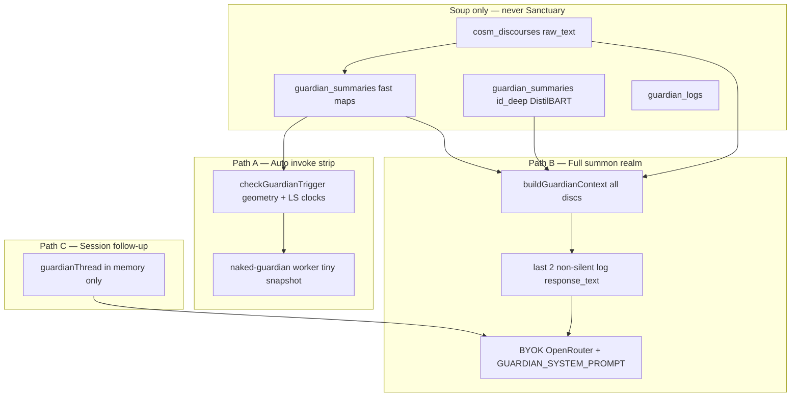

# Guardian & Cartographer Refinement — Roadmap Blueprint

> **Status:** **ARCHAEOLOGY** — all phases C1–C8, G0–G5 shipped. Preserved as build history + external review log.  
> **Active contract:** `witness-loop-upgrade-blueprint.md` · **Master routing:** `NakedQuantum-app-blueprint.md` §2.
>
> **Retired May 2026:** Track **A — Auto strip** (Soup banner + `naked-guardian` Cloudflare Worker) is **removed from the PWA**. Witness substrate + voluntary summon replace it. See `workers/guardian-invoke/RETIRED.md`. Historical `auto_invoke` logs remain in vault.

> **Canonical roadmap** for evolving Guardian from *accurate mirror* toward *obsessive meta‑meta cognition* — and hardening Cartographer so the mirror does not lie at the sensory layer.
>
> Consolidates: co-creator Guardian architecture session (May 2026), Kimi 2.6 honest review, cartographer v0.3 merge (PR #31), and Kaja’s production/dev intent.
>
> **Read with:** `lighthouse-cockpit-blueprint.md` (desktop strip / cockpit — *wait for laptop/Tauri*), `NQ blueprint.md`, `AGENTS.md`.

---

## 0. How to use this document

| Rule | Meaning |
|------|---------|
| **One batch at a time** | Pick the next unchecked item; ship; tick + date in **Shipped log**; re-read this file before the next batch. |
| **Blueprint first** | If implementation diverges, update **this file** (or spell delta in PR), not only chat. |
| **Sanctuary is blind** | Guardian never reads Sanctuary, characters-in-chat, or pre-Engram private writing. |
| **Geometry vs language** | Cartographer + Watcher = always-on dumb signal; Guardian language = rare, bounded, dismissible. |
| **Zero-deps default** | No npm for Cartographer fixes; lexicon expansion manual or offline-bundled only if Kaja approves. |

---

## 1. North star

**Not:** a mirror that reflects the archive back (intimidating, sacred, passive).

**Not:** a chatbot coach, wellness tone, or spammy “AI insights.”

**Yes:** a **witness with memory shape** — can doubt its own prior theories using structured data, not only two paragraphs of past prose.

| Today (architecturally) | Target |
|-------------------------|--------|
| Auto strip: one-liner from single-discourse geometry | Cheap path that can reference **one prior theory line** |
| Summon: full archive dump + last 2 log texts | **Tiered** archive + **witness ledger** + geometry diffs |
| Prompt asks “compare your last witness” | Database gives Guardian **enough of himself to wonder** |
| Labels like “Completely detached” | **Suggests…** + confidence; consensus before strong claims |

**One sentence:** Cartographer measures honestly; Watcher connects; Guardian speaks rarely — and when he speaks, he remembers what he claimed and can see whether the archive moved.

---

## 2. Constraints (not excuses — design boundaries)

| Constraint | Implication for this roadmap |
|------------|------------------------------|
| Built on **iPhone**, no laptop yet | Monolithic `app.js`, main-thread models, inline SQL worker — **acceptable for now**; module split waits for Tauri/desktop gate. |
| **Safari** gates workers/CORS/blob WASM paths | Prefer fixes that work in PWA today; don’t assume Worker-first ML without a Safari proof. |
| **Zero user / dev mode** | Thresholds intentionally low for continuous testing; **production values** documented in §3 — must be flipped before “real” ship. |
| **Abyss ~0.10** | Hash layout is placeholder; **3D living cosmos** is the goal; honesty label or embedding-driven layout comes before pretending x/y is semantic. |
| **DistilBART deep maps** | Already the compression layer before Guardian; summon diet = **when/what tier** hits the model, not “add summarization.” |

---

## 3. Dev vs production knobs (record when changed)

| Knob | Dev (now) | Production intent (Kaja) |
|------|-----------|---------------------------|
| Guardian auto-invoke cadence | Low cooldowns, easy qualifiers | ~**72h** minimum; only if **important** |
| Watcher similarity threshold | ~0.5 (testing) | **0.72+** |
| Dismiss backoff | 5+ with &lt;2 qualifiers; cap 10 | Keep ethics; raise qualifier **confidence** bar |
| Auto-invoke surface | **Strip under header only** — never modal, never other realms | Unchanged |
| Summon context | All discourses’ fast maps + all deep maps + watcher aggregates | **Tiered** (§7) |
| Auto-invoke default (PWA) | Dev: low thresholds for testing | **Onboarding explains strip** + user can turn off; **Settings** master toggle; long-press strip off (later). Production cadence §3 still applies when on. |
| Auto-invoke (desktop) | N/A on PWA | Real-time Guardian whisper in **Lighthouse cockpit** — `lighthouse-cockpit-blueprint.md`; separate channel, not Soup strip spam |

---

## 4. Guardian today — three doors, one archive



### What each path is fed

| Path | Trigger | Data fed | Own logs / bias memory? |
|------|---------|----------|-------------------------|
| **A — Auto strip** | After `generateFastMap` + `checkGuardianTrigger` | Worker snapshot: orbiting terms, writing signature, silence markers, paradox/contradiction flags, dominant theme — **not** raw text, **not** archive | **No** |
| **B — Full summon** | User summons (BYOK) | `buildGuardianContext`: every discourse fast map (or excerpt), all `*_deep` summaries, watcher top links + recurring terms + arc aggregates; **+ last 2** `guardian_logs.response_text` with compare instructions | **Partial** — 2 prose blobs only |
| **C — Follow-up** | User types in Guardian realm | `guardianThread` + initial `guardianContextBlock` | Session only; **not** reloaded next summon |

### Data layers (Guardian-visible)

| Layer | Source | Notes |
|-------|--------|-------|
| 0 | Soup discourses only | `getDiscourses()` — engrammed archive |
| 1 | Fast maps | `cartographer.js` → `generateFastMapData` + `injectWatcherFlags` → `guardian_summaries` (`map_type: 'fast'`) |
| 2 | Deep maps | Sovereign Cartographer run → `{id}_deep` DistilBART |
| 3 | Watcher aggregates | On full summon only: top links, recurring terms, arc patterns |
| — | `log_type`, `auto_invoked`, `triggered_by` in DB | **Not** in LLM context today |

### Gap (why it still feels like a mirror)

- Prompt says Guardian is **not** a mirror; architecture still **reflects** (archive dump + compare two monologues).
- **Obsessive meta‑meta cognition** needs **memory shape**: prior claims indexed, geometry-then-vs-now, explicit uncertainty — not only “last 2 paragraphs.”

---

## 5. Epistemological gaps (Kimi + our code review)

| Layer | Risk | Roadmap phase |
|-------|------|----------------|
| **Sensory** (Cartographer) | Tiny lexicons, no negation, `-ing` stemmer mangles `nothing`→`noth`, noisy paradox window, strong labels without confidence | **§6** |
| **Interpretive** (Guardian summon) | Linear context growth with archive size; deep maps + all fast maps | **§7** |
| **Cross-modal** | Watcher similarity vs Cartographer arc not synthesized | **§8** |
| **Representational** (Abyss) | Hash x/y + similarity lines look semantic | **§9** |
| **Interruption** (Auto-invoke) | Weak qualifiers in dev mode | **§10** + §3 production knobs |
| **Self-model** (Guardian) | No witness ledger, no theory diff | **§7 G1–G4** |

---

## 6. Phase C — Cartographer hardening (highest leverage first)

*Cartographer is the nervous system for Guardian, auto-invoke, and Abyss dots. Fix sensing before more Guardian prose.*

- [x] **C1 — Stemmer safety** — Never emit broken stems (`nothing`→`noth`, `thing`→`th`). `LEXICON_WORDS` guard + `VALID_STEMS` suffix strip only. *(Shipped v0.4)*
- [x] **C2 — Negation flipper** — `NEGATORS` + `lexiconHitRate` / `wordSentimentPolarity`; contractions → `dont`, `cant`, etc. *(Shipped v0.4)*
- [x] **C3 — Lexicon expansion** — Major curated batch in `lex()` sets (~3–5× core categories); manual adds + laptop script still welcome. *(Shipped v0.5)*
- [x] **C3b — `carto_version` tagged re-map** — `CARTO_VERSION` on fast maps; remaps when stale. *(v4 → v5)*
- [x] **C4 — Detector confidence** — `confidence` on detectors; `collectFastMapQualifiers` gates at `MIN_QUALIFIER_CONFIDENCE` (0.4). *(Shipped v0.5)*
- [x] **C5 — Label softening** — Depersonalisation uses “Suggests…” labels. *(Shipped v0.5)*
- [x] **C6 — extractiveSummary** — `splitSentences`; score all sentences (short lines penalized, not dropped). *(Shipped v0.5)*
- [x] **C7 — Paradox proximity** — Per-sentence + `wordParadoxPolarity` (excludes ambient dark/light); stricter density thresholds. *(Shipped v0.5)*
- [x] **C8 — Tokenize once** — `generateFastMapData` tokenizes once; passes `tokens` to key detectors. *(Shipped v0.5)*

**Shipped (main):** PR #31 — emotional arc fix, orphan block removed, `tokenize` in summary/incompleteness, `depersonalisation` in `buildGuardianContext`, `silenceMarkers` rename.

---

## 7. Phase G — Guardian meta-memory & summon diet

### G0 — Understand (done)

- [x] Document three paths, data layers, log behavior (this blueprint §4).

### G1 — Witness ledger (local, no new LLM) ✅ shipped

- [x] Extend `guardian_logs` with structured fields: `primary_discourse_id`, `qualifiers[]`, `theory_one_line`, `geometry_snapshot` (see G2), `log_type`, `auto_invoked`, `triggered_by`.
- [x] On summon: feed **last N structured theories** — **default N = 3** (override in decisions log if Kaja wants 5).
- [x] Include `log_type` / `auto_invoked` / `triggered_by` in context so Guardian can separate strip vs summon voice.

**`theory_one_line` — decided (Kimi review, pending Kaja ack):** **Rule-based first**, not LLM-extracted.

| Approach | Use |
|----------|-----|
| LLM-extracted | Defer — extra cost, drift from actual claim |
| Rule-based | **Ship** — deterministic, inspectable |

Template from primary qualifier + terms, then append first substantive sentence from `response_text` (first non-empty line after any greeting):

| Qualifier | Template |
|-----------|----------|
| `orbit` | `I noted you were orbiting [terms] without resolution.` |
| `paradox` | `I saw tension between [pairs].` |
| `escalating_arc` | `I read the arc as escalating.` |
| `silence` | `I read deliberate silence as structure.` |
| `inversion_loop` | `I read perpetual self-argument in the phrasing.` |
| (summon, no qualifier) | First substantive sentence only |

### G2 — Geometry snapshot & self-diff (heart of witness — **elevated priority**) ✅ shipped

*Mirror: “You are anxious.” Witness: “You were anxious then; geometry still shows the same orbit terms.” That requires **temporal comparison**, not only last-2 prose logs.*

- [x] On every invoke (strip + summon): persist `geometry_snapshot` on `guardian_logs`:

```js
// geometry_snapshot (JSON on guardian_logs)
{
  discourse_id: "d_...",
  orbit_terms: ["fear", "void"],
  arc_direction: "tentative → escalating",
  silence_ratio: 0.12,
  pronoun_dominant: "I",
  depersonalization_label: "Balanced perspective",
  word_count: 340,
  carto_version: 3
}
```

- [x] On summon: `geometryDelta(priorSnapshot, currentMap)` → inject `GEOMETRY SINCE LAST WITNESS` (facts only):

```js
// geometryDelta — illustrative; implement in app.js at context-build time
function geometryDelta(prior, currentMap) {
  const changes = [];
  const currentTerms = new Set((currentMap.key_terms || []).map(k => k.term));
  const stillOrbiting = (prior.orbit_terms || []).filter(t => currentTerms.has(t));
  if (stillOrbiting.length) changes.push('still orbiting ' + stillOrbiting.join(', '));
  if (prior.arc_direction && currentMap.emotional_arc &&
      prior.arc_direction !== currentMap.emotional_arc.direction) {
    changes.push('arc shifted from ' + prior.arc_direction + ' to ' + currentMap.emotional_arc.direction);
  }
  return changes.length ? changes.join('; ') : null;
}
```

- [x] Compare against **last invoke on same `discourse_id`** when present; else last global invoke snapshot.
- [x] Makes G1 ledger useful; feeds G4 strip with one prior theory line.

### G3 — Tiered summon context (fix “memory bomb”) ✅ shipped

- [x] **Tier 1 (sacred):** Last **3** discourses by **`updated_at`** (fallback `created_at`) — full fast maps + edges + depersonalisation + new dimensions.
- [x] **Tier 2:** Top **5** watcher links — **one `divergenceNote` line per link** (§8), not raw pair lists.
- [x] **Tier 3:** Deep maps only for discourses returned by **`selectUrgentDiscourses`** (max 5) — see §15. Do not dump every `*_deep` row on summon.
- [x] **Tier 4:** Archive rollup — counts, date span, arc aggregates (one short paragraph).

**Context budget — decided caps (Kimi review):**

| Block | Budget | Notes |
|-------|--------|-------|
| Archive material (Tiers 1–4) | **~2,500 tokens** (~10,000 chars) | Truncate Tier 4 first, then 3, then 2. **Never drop Tier 1.** |
| Prior witness (ledger + G2 diff + last prose) | **~500 tokens** (~2,000 chars) | Structured theories before long raw `response_text` |
| System + instruction | remainder | `GUARDIAN_SYSTEM_PROMPT` + summon instructions |

Rough rule in code: `chars / 4 ≈ tokens`. DistilBART ~80 tokens × many discs is why Tier 3 must stay urgent-only.

- [x] Implement `applyGuardianArchiveBudget` (~10k chars) + prior witness cap (~2k) in `buildGuardianPriorWitnessBlock`.

### G4 — Worker strip upgrade (optional, cheap) ✅ shipped

- [x] Auto-invoke worker receives **one prior theory line** + current snapshot (still no full archive).
- [x] Starts minimal “wondering” without summon cost.

### G5 — Guardian interaction (beyond mirror) ✅ shipped

- [x] Refine `GUARDIAN_SYSTEM_PROMPT` for meta-cognition: questions not verdicts; explicit uncertainty; SILENCE unchanged.
- [x] UI: less intimidating / more accurate — copy and rhythm in Guardian realm (design pass; no Sanctuary bleed).
- [x] Follow-up sessions: optional reload of **ledger summary** (not full thread JSON) on new summon.

### G6 — Cockpit whisper (desktop — defer)

- [ ] See `lighthouse-cockpit-blueprint.md` Phases A–D; uses ledger + live map.
- [ ] **Gate:** laptop / Tauri shell ready.

**Anti-edgy guardrails (all G phases):** dismiss; silence; no Sanctuary; rate limits; strip-only auto surface.

---

## 8. Phase X — Cross-modal synthesis (Watcher × Cartographer)

*Highest-leverage single line in summon context. Implement in `buildGuardianContext` when resolving Tier 2 links.*

- [x] `divergenceNote(link, mapA, mapB)` — return one line or `null` *(in Tier 2 summon block)*:

```js
function divergenceNote(link, mapA, mapB) {
  const simScore = Math.round((link.score || 0) * 100);
  const arcA = mapA?.emotional_arc?.tension_shift || 0;
  const arcB = mapB?.emotional_arc?.tension_shift || 0;
  const arcDiff = Math.abs(arcA - arcB);
  if (arcDiff > 0.03) {
    const labelA = arcA > 0.01 ? 'escalating' : arcA < -0.01 ? 'resolving' : 'flat';
    const labelB = arcB > 0.01 ? 'escalating' : arcB < -0.01 ? 'resolving' : 'flat';
    return `Echo at ${simScore}% but emotional arcs diverge (${labelA} vs ${labelB}).`;
  }
  const domA = mapA?.pronoun_trajectory?.dominant;
  const domB = mapB?.pronoun_trajectory?.dominant;
  if (domA && domB && domA !== domB) {
    return `Echo at ${simScore}% but pronoun register shifted (${domA} → ${domB}).`;
  }
  return null;
}
```

- [ ] Feed into **Tier 2** only; skip link if `null` (no interesting divergence).
- [ ] Do **not** merge Watcher into Cartographer — synthesize at context-build time in `app.js` (or future `guardian.js`).

---

## 9. Phase AB — Abyss honesty (canonical: `abyss-v021-blueprint.md`)

*Current on `main`: hash-seeded positions (`abyssHash(d.id)`); threads connect hash points — ritual layout, not semantic map.*

**Implementation contract:** [`abyss-v021-blueprint.md`](abyss-v021-blueprint.md) — two batches (honest sky → Sanctuary + interaction).

- [x] **AB v0.21 Batch 1** — M1/M1b settle, M2 DNA, M5 weather, AB1 label, Watcher threshold alignment
- [x] **AB v0.21 Batch 2** — M3 Sanctuary presence, M4 tooltip + Enter ◈, edge-safe overlays
- [ ] **AB2 — 3D cosmos / offline UMAP** — Deferred; laptop snapshot when Tauri (`lighthouse-cockpit-blueprint.md`). Vectors already in IDB; in-browser UMAP not required for v0.21.

*Does not block Guardian G phases (shipped). Blocks marketing Abyss as a semantic “mind map” until Batch 1 lands.*

---

## 10. Phase A — Auto-invoke production ethics (PWA)

*PWA cannot host real-time Lighthouse Guardian (memory/CPU) — that lives on desktop per `lighthouse-cockpit-blueprint.md`. PWA = Soup strip only.*

- [ ] **A1 — Production thresholds** — When auto-invoke is on: §3 (72h, 0.72+ watcher, confidence-gated qualifiers). Dev knobs stay for Kaja testing until flip.
- [ ] **A2 — Onboarding + Settings (Kaja decision)** — On first run (or Guardian onboarding step): explain the **strip under header**, what it does, offer **turn off now**. Persist `nq_guardian_auto_invoke_enabled` (or equivalent). **Settings:** master “Guardian may interrupt” + optional per-trigger toggles later.
- [ ] **A2b — Strip UX (later)** — Long-press strip → disable auto-invoke or dismiss session (quick sovereignty exit).
- [ ] **A3 — Consensus** — When enabled: 2+ **high-confidence** qualifiers OR single “strong” signal (define in C4/C5).

*Strip under header remains the **only** PWA auto surface — never modal, never Sanctuary, never Lighthouse write column.*

---

## 11. Phase ARCH — Structural (later, not blocking truth)

| Item | Gate |
|------|------|
| Split `app.js` → `db.js`, `watcher.js`, `guardian.js`, `abyss.js`, UI modules | Tauri / build story / Kaja approval |
| Panel state machine instead of `showPanel` god path | After split or desktop |
| Single-flight embedder load/dispose (Guardian entry) | iPhone 14 soak test |
| iPhone 14 memory soak | Before raising Watcher/DeepMapper concurrency |

*Kimi’s “split app.js” is valid; **not** laziness — Safari + solo iPhone dev order.*

---

## 12. Recommended batch order (one by one)

| Order | Phase | Why |
|-------|-------|-----|
| 1 | **C1–C2** | Stop lying at sensory layer — *feel Guardian voice change here* |
| 2 | **C3b** + **C3–C5** | `carto_version` + lexicons + confidence + soft labels (ship C1–C2 with version bump) |
| 3 | **G2 + G3** | **Parallel or G2 first** — snapshot/diff + tiered diet; witness needs time, not dump |
| 4 | **G1** | Ledger templates; needs G2 snapshots to matter |
| 5 | **X1** | `divergenceNote` into Tier 2 |
| 6 | **G4–G5** | Strip prior theory + prompt/UI interaction |
| 7 | **A1–A3** | Production thresholds + default-off opt-in |
| 8 | **C6–C8** | Summary/paradox/perf polish |
| 9 | **Abyss v0.21** (`abyss-v021-blueprint.md`) | Batch 1 honest sky → Batch 2 Sanctuary + M4 |
| 10 | **G6, ARCH** | Desktop / refactor when laptop ready |

*Kimi review (May 2026): agreed C1–C2 first; elevate G2; default auto-invoke OFF; tagged re-map.*

---

## 13. Explicitly out of scope (unless amended)

- Sanctuary surveillance or Guardian in Sanctuary chat.
- Replacing Cartographer with one big LLM for geometry.
- npm/bundler for lexicon expansion without approval.
- Auto-invoke modals, banners, or notification-style spam.
- Open-sourcing or growth-hack onboarding.

---

## 14. Related documents

| Doc | Relationship |
|-----|----------------|
| `nq-review-checkpoint-2026-05.md` | **Code review checkpoint** — syntax, risks, what to do / not do / how (base for next sessions) |
| `abyss-v021-blueprint.md` | **Abyss honest sky** — two-batch contract (layout, DNA, Sanctuary, M4) |
| `lighthouse-cockpit-blueprint.md` | Desktop write column + live strip; Guardian whisper channel; **wait for Tauri** |
| `NQ blueprint.md` | Realms, Engram, core ethics |
| `NakedQuantum story.md` | Vision and tone |
| `AGENTS.md` | Agent collaboration, Safari, lint |
| Kimi review (conversation export) | External honest review — sensory/interpretive/representational gaps |

---

## 15. Decisions log & remaining open questions

### Decided (Kimi blueprint review — incorporate unless Kaja overrides)

| Topic | Decision |
|-------|----------|
| `theory_one_line` | Rule-based templates + first substantive response line |
| Witness count N | **3** on summon |
| Tier 1 sort | **`updated_at`** (fallback `created_at`) |
| Summon context cap | **~2,500** archive + **~500** prior witness tokens |
| Truncation order | Drop Tier 4 → 3 → 2; Tier 1 sacred |
| Re-map after Cartographer changes | **Tagged `carto_version`** (C3b) |
| Lexicon expansion assist | One-time Python script, not shipped — Kaja curates output |
| Auto-invoke (Kimi) | OFF until opt-in — **PWA variant:** onboarding explain + opt-out + Settings (§10) |
| Batch order | **G2 alongside / before G3** |

### Decided (Kaja, May 2026)

| Topic | Decision |
|-------|----------|
| **Deep map Tier 3** | **Keep `selectUrgentDiscourses`** — already scores contradictions, high echoes, escalating arc (`tension_shift > 0.02`), length, recency, missing deep map. Top 5 only on summon. No separate “arc-only” rule needed. |
| **Lexicon assist** | Manual curation now; laptop script later; GloVe vs word2vec **does not matter** — pick best tool when scripting. |
| **PWA auto-invoke UX** | Onboarding explains + opt-out; Settings master off; long-press strip later. Not desktop-real-time on PWA. |
| **Desktop Guardian** | Real-time in Lighthouse editor — `lighthouse-cockpit-blueprint.md` (G6), after Tauri. |

**Why keep urgent heuristic (not replace):** Pure “all deep maps” blows the 2,500-token cap. Pure “arc delta only” misses watcher contradictions and recency. `selectUrgentDiscourses` is already a **tie** across geometry + watcher + time — extend scores in code if needed, don’t replace the function.

### Still open

1. **`CARTO_VERSION`** — currently **5**; bump on each cartographer schema/lexicon breaking change.
2. **Onboarding default** — strip enabled after onboarding unless user opted out, vs disabled until opt-in? *(Implement A2 with clear copy either way.)*

```
(Kaja overrides / notes)
```

---

## 16. External review log

| Reviewer | Date | Summary |
|----------|------|---------|
| Kimi 2.6 | 2026-05 | Honest app review → epistemological gaps |
| Kimi 2.6 | 2026-05 | Blueprint review: tighten C3 workflow, G1/G2/G3 caps, X1 sketch, default-off auto-invoke, elevate G2, `carto_version` — merged into §6–§12, §15 |

---

## Shipped log

| Item | Date | Notes |
|------|------|-------|
| G0 | 2026-05 | Three-path architecture documented (co-creator session) |
| Cartographer PR #31 | 2026-05 | Blockers, tokenize consistency, depersonalisation in summon context, silenceMarkers |
| This blueprint pinned | 2026-05-18 | Roadmap consolidates Guardian + Kimi + production intent |
| Kimi blueprint review merged | 2026-05-19 | G2 elevated, caps, theory_one_line, carto_version, divergenceNote sketch |
| Kaja decisions merged | 2026-05-19 | Keep urgent deep maps; manual lexicons; PWA onboarding/settings auto-invoke; desktop → lighthouse cockpit |
| PR #31 + #32 on main | 2026-05 | Cartographer v0.3 + roadmap pinned |
| **C1–C2 + C3b** | 2026-05-19 | cartographer v0.4: safe stemmer, negation, `CARTO_VERSION` 4, remaps on save |
| **C3–C8** | 2026-05-19 | v0.5: lexicon expansion, confidence, soft labels, summary, paradox, tokenize-once; `CARTO_VERSION` 5 |
| **G2 + G3 + X1** | 2026-05-19 | Tiered summon, geometry snapshot/delta, divergenceNote in context |
| **G1 + G4 + G5** | 2026-05-18 | Witness ledger (theory_one_line, qualifiers), strip prior theory, prompt + UI witness copy |

---

*Closer to the code and philosophy than anyone else: Kaja + the next agent who reads this file first.*
