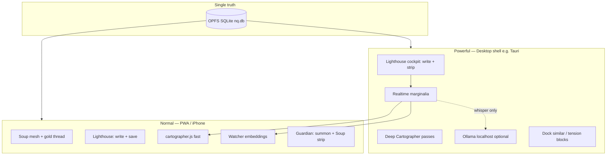

# Lighthouse Cockpit Blueprint

> **Canonical base contract** for evolving NakedQuantum from *mirror* (user feels reflected) toward *instrument consciousness* (geometry works while you write; language is rare; user chooses when to look).
>
> Read this before any Lighthouse strip, desktop shell, or Ollama work. If implementation diverges, update **this file first**, then code — not only chat.
>
> Born from co-creator discussion (May 2026). Changes may revise phases and numbers; they should not silently abandon the contracts below.

---

## 0. How to use this document

| Rule | Meaning |
|------|---------|
| **Blueprint first** | Propose deltas in plain English; align here; then one implementation batch. |
| **Two masters** | Every feature ask: *“Would I want this if zero people paid?”* (soul) vs Vessel (subscription, clarity). |
| **Sanctuary is blind** | Nothing in this blueprint runs inside Sanctuary or reads Sanctuary data. |
| **Shipped log** | Check boxes and add dates at the bottom when a phase lands on `main`. |

---

## 1. North star (do not trade away)

**Not:** another editor, wellness coach, or edgy void aesthetic.

**Yes:** a **writing cockpit** — main surface for thought + a **narrow live strip** that gathers honest context while you write.

| Mirror (what user feels today) | Cockpit (what we build toward) |
|--------------------------------|--------------------------------|
| “It saw me” after the fact | Something **works in parallel** while drafting |
| Reflection when user opens Soup / logs | **Geometry always** (Cartographer, embeddings); **language sometimes** (Guardian whisper) |
| Passive | **Active but bounded** — never omniscient, never trapping |

**One sentence:** Write in the column; the strip thinks in public only where allowed; Watcher speaks **on ask**; Guardian **wonders** sparingly; Sanctuary never watched.

---

## 2. Two product lanes (same organism, different posture)



| Lane | Role | LLM |
|------|------|-----|
| **PWA (Normal)** | Sovereign daily carry: capture, mesh, engram, lighthouse write, summon Guardian, Watcher thread | BYOK OpenRouter / worker when user summons — **no Ollama requirement** |
| **Desktop (Powerful)** | Same vault; **lighthouse cockpit** with live strip, docked context blocks, deeper passes | **Ollama** = ultimate BYOK on machine; still optional |

**Principle:** PWA must not bloat into desktop. Desktop must not fork schema or break Sanctuary/Soup walls.

---

## 3. Lighthouse today vs lighthouse target

| Today | Target (desktop-first; PWA may keep simple write) |
|-------|--------------------------------------------------|
| `#content-textarea` + save extracts title from body | Same truth model; editor may stay textarea → later `contenteditable` or minimal TipTap **only if blocks need anchors** |
| Cartographer on explicit run / map flows | **Debounced fast Cartographer** on current paragraph / selection in strip |
| Guardian auto-invoke mainly **Soup** (strip, folder summon) | **Two rooms, one voice** — see §6 |
| Watcher surfaces in Soup thread | Strip: **“Reveal connections”** button — no auto web while typing |
| Header hidden in lighthouse | Unchanged |

**This is not “a bigger textarea.”** It is **editor + instrument panel**.

---

## 4. Cockpit layout (reference)

```
┌──────────────────────────────────────────┬─────────────────────┐
│  WRITE                                   │  STRIP (live)       │
│  discourse draft                         │  similar (max 2–3)  │
│  textarea → CE / TipTap when justified   │  tension (max 1–2)  │
│                                          │  guardian ? (rare)  │
│                                          │  [reveal watcher]   │
└──────────────────────────────────────────┴─────────────────────┘
         │ click strip item (phase C)
         ▼
   optional DOCK BLOCK (read-only excerpt, not merged into source)
```

**Strip width:** narrow (~20–28% viewport max on desktop); collapsible; never covers write column on mobile PWA v1.

---

## 5. Strip channels — contracts

### 5.1 Cartographer (geometry — always on in cockpit)

- **Trigger:** debounce after typing pause (start: **2000ms**; tune in implementation).
- **Input:** current paragraph or selection, not whole vault every keystroke.
- **Output:** labels, sentiment/tension signals, key terms — **no LLM required**.
- **UI:** compact chips / lines; max **3** visible geometry lines before scroll.
- - **Rule:** Cartographer never speaks. It computes and passes structured 
  data only. Guardian speaks or nothing speaks.

### 5.2 Watcher (similarity — on ask)

- **Trigger:** user clicks **“Reveal connections”** (or equivalent).
- **Input:** local embeddings index (existing Xenova / queue).
- **Output:** 2–3 links with titles; optional strength indicator.
- **Never:** auto-popup graph or pulsing web during typing.

### 5.3 Tension / contradiction (data only — no copy)

- **Phase B–C:** rule-based detection first (sentiment flip, negation, 
  always/never vs prior line in this discourse or cited other id).
- **Output:** structured signal passed to Guardian — discourse id, 
  contradicting terms, confidence. Never rendered as text in the strip directly.
- **Guardian decides** whether the tension is worth naming and finds 
  the language. If Guardian is offline or rate-limited — strip stays empty. 
  Silence is correct.
- **Not:** “Contradiction detected”, question copy from Cartographer, 
  red shame, or performance hostility.

### 5.4 Guardian (wonder — rare)

- **Soup room (existing):** summon, logs, folder auto-invoke, invoke strip — archive oracle.
- **Lighthouse room (new):** one short whisper after **longer idle** or explicit **?** — rate-limited per discourse session.
- **Source (desktop):** Ollama localhost preferred; fallback BYOK; same persona, shorter contract than full summon.
- **Max:** suggest **1 whisper / 5 min active editing** and **dismiss for this discourse** — tune in implementation.

---

## 6. Guardian: two rooms, one voice

| Room | Where | Behavior |
|------|-------|----------|
| **Archive** | Soup, Guardian realm, logs | Full summon, auto-invoke from map trigger, cold honesty |
| **Cockpit** | Lighthouse strip only | Micro-observation; local/small model; never full-screen takeover |

**Rule:** Soup strip and Lighthouse strip must **not** both shout at once. If both fire, Lighthouse wins while `view-lighthouse` is active.

---

## 7. Ollama (desktop BYOK layer)

**Use Ollama for:** Guardian whisper text, richer contradiction phrasing, optional block summaries.

**Do not use Ollama for:** similarity search (Watcher vectors), fast structure (Cartographer JS), encryption, sync, OPFS.

| Concern | Approach |
|---------|----------|
| Setup friction | Accept for cult niche; document model + URL in Data/settings |
| Privacy | Localhost only; no cloud requirement |
| Cost | User’s machine; aligns with Vessel + BYOK ethics |
| PWA | No hard dependency on Ollama in v1 |

---

## 8. Anti-edgy guardrails (seesaw: philosophy ↔ performance)

| Test | Keep | Cut / rework |
|------|------|----------------|
| Consent | User opens strip channel or idle whisper with dismiss | Surprise shock copy |
| Reversibility | Dock block close; dismiss whisper; export always | Trapped shame |
| Language vs geometry | Dots/chips default; words optional | LLM every sentence |
| Sanctuary | Zero access | Any “scanning your chat” |
| Silence | Empty strip when nothing honest | filler aphorisms |

**Mantra:** add **ritual**, not **adjective**.

---

## 9. Implementation phases (order matters)

### Phase A — Strip shell + debounced fast Cartographer

- [ ] Desktop or feature-flagged lighthouse split layout (write | strip).
- [ ] Debounced `cartographer.js` on draft text (paragraph/selection).
- [ ] Strip renders geometry only; empty state allowed.
- **Files (expected):** `index.html` (lighthouse structure), `app.css`, `app.js`, `cartographer.js` (if new export needed).

### Phase B — Watcher on demand in strip

- [ ] “Reveal connections” control; 2–3 results from existing embedding index.
- [ ] No auto-surface in Soup thread while in lighthouse.

### Phase C — Tension heuristics + dock blocks

- [ ] Rule-based tension lines in strip (questions).Caution: only used my highly capable model, never answers by cartographer.js 
- [ ] Click strip item → dock read-only block beside draft (desktop).
- [ ] Blocks are **context**, not edits to source engrams.

### Phase D — Ollama adapter (desktop)

- [ ] Settings: Ollama base URL, model id, enable lighthouse whisper.
- [ ] Guardian cockpit channel uses local model; rate limit + dismiss.
- [ ] Fallback to existing BYOK path if Ollama offline.

### Phase E — Powerful shell

- [ ] Tauri (or agreed shell) loads same PWA assets + `nq.db` path.
- [ ] Lighthouse cockpit enabled by default on desktop; PWA unchanged.
- [ ] Vite only when batch gate says stable — not a prerequisite for A–D experiments.

---

## 10. Explicitly out of scope (unless blueprint amended)

- Sanctuary surveillance or “helpful” AI in chat while typing.
- Bidirectional Sanctuary ↔ Soup data move.
- Auto Watcher graph during lighthouse write.
- npm dependency sprawl (TipTap only if block anchors justified in writing).
- Open-sourcing the codebase.
- Growth/SEO/dopamine onboarding tours.
- Replacing Cartographer or Watcher with a single “big LLM” in the strip.

---

## 11. Related documents

| Doc | Relationship |
|-----|----------------|
| `NakedQuantum story.md` | Vision, ethics, why uncomfortable |
| `NQ blueprint.md` | Realms, Engram, Watcher, Guardian (pre-cockpit) |
| `NakedQuantum Roadmap.md` | Shipped history; Tauri/Vite futures |
| `AGENTS.md` | Agent collaboration rules |

---

## 12. Open questions (resolve before Phase D)

1. **Debounce ms** — 2000ms vs 2500ms for Cartographer on mobile-class CPU in desktop shell?
2. **Whisper model** — fixed small model vs user picks in Ollama?
3. **Block dock** — side panel vs bottom sheet on narrow desktop windows?
4. **PWA strip** — ever, or desktop-only forever for live strip?

Record decisions here when Kaja decides:

```
(decisions log)
```

---

## Shipped log

| Phase | Date | Notes |
|-------|------|-------|
| — | — | Blueprint pinned; no cockpit code yet |

---

*“Yap is architecture.” — valid. This file is the map; code is the walk.*
